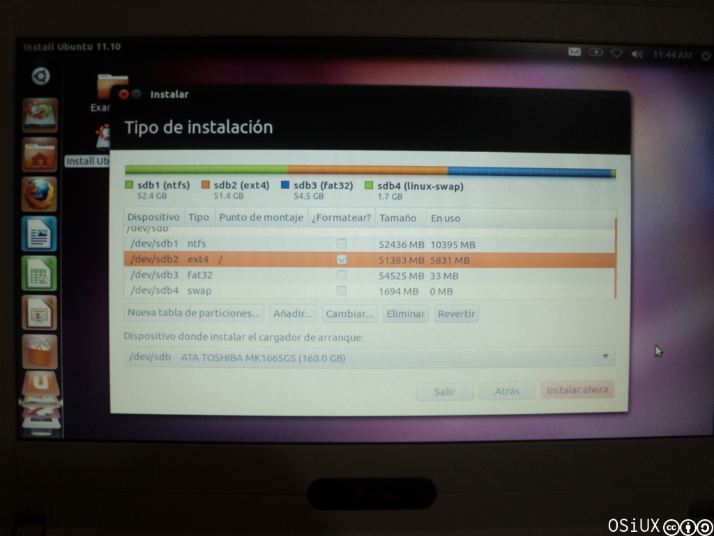
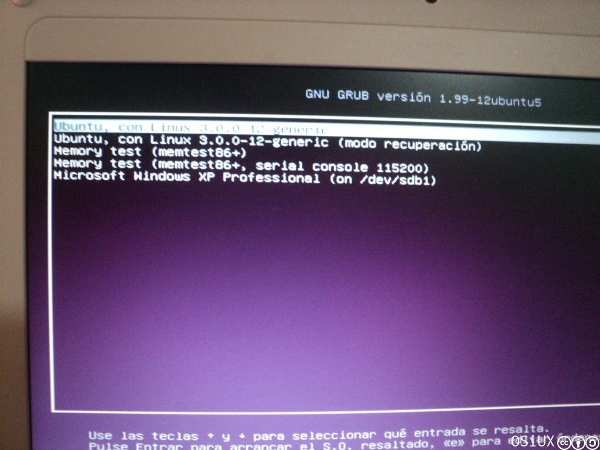

[`.org`](https://gitlab.com/osiux/osiux.gitlab.io/-/raw/master/2011-10-24-software-libre-en-monte-caseros-y-ubuntu-11.10-en-conectar-igualdad.org) |
[`.md`](https://gitlab.com/osiux/osiux.gitlab.io/-/raw/master/2011-10-24-software-libre-en-monte-caseros-y-ubuntu-11.10-en-conectar-igualdad.md) |
[`.gmi`](gemini://gmi.osiux.com/2011-10-24-software-libre-en-monte-caseros-y-ubuntu-11.10-en-conectar-igualdad.gmi) |
[`.html`](https://osiux.gitlab.io/2011-10-24-software-libre-en-monte-caseros-y-ubuntu-11.10-en-conectar-igualdad.html)

El viernes estuve en Monte Caseros y el sábado en Curuzú Cuatiá, el
viaje tuvo buenos resultados, en primer lugar dí un par de charlas sobre
Software Libre, Cooperativismo, Redes Libres y en segundo lugar instalé
un Ubuntu 11.10 en las notebooks de Conectar Igualdad, comparto dos
notas sobre cada día y espero que le sea útil a más de uno.

-   [Software Libre en las Olimpíadas Informáticas de Monte
Caseros](olimpiadas-informaticas-en-monte-caseros)
-   [Instalando Ubuntu 11.10 en Exomate de Conectar
Igualdad](ubuntu-11.10-en-exomate-de-conectar-igualdad)
