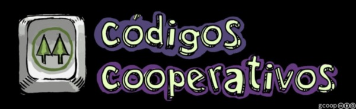

[`.org`](https://gitlab.com/osiux/osiux.gitlab.io/-/raw/master/2012-09-07-gcoop-gano-concurso-imagenes-del-cooperativismo.org) |
[`.md`](https://gitlab.com/osiux/osiux.gitlab.io/-/raw/master/2012-09-07-gcoop-gano-concurso-imagenes-del-cooperativismo.md) |
[`.gmi`](gemini://gmi.osiux.com/2012-09-07-gcoop-gano-concurso-imagenes-del-cooperativismo.gmi) |
[`.html`](https://osiux.gitlab.io/2012-09-07-gcoop-gano-concurso-imagenes-del-cooperativismo.html)



En el marco del *Concurso de Videos* del
*`Congreso Argentino de las Cooperativas (CAC)`* [^1] realizamos el
video *`Códigos Cooperativos`* [^2] junto con la ****Cooperativa La
Olla****.

En el cierre del Congreso se realizó la entrega de Premios y fuimos
premiados con el ****Primer Premio de la Categoría Profesional****.

Agradecemos a *`COOPERAR`* [^3]
*`Confederación Argentina de Cooperativas`* a *`FECOOTRA`* [^4]
/=Federación Argentina de Cooperativas de Trabajo, por invitarnos a
participar del Congreso y muy especialmente: A ***Daniel Henriquez*** y
la ***Cooperativa La Olla***, a ***malefico*** [^5] por los dibujos
libres, a ***Camanchaca*** [^6] por la música original libre.

## *Miralo, Bajalo, Disfrutalo*

```{=html}
<video controls="controls" width="640" height="360" src="http://archive.org/download/codigos-cooperativos-gcoop/gcoop-codigos-cooperativos-1280x720.ogv"></video>

```
-   [Descargar
Video](http://archive.org/details/codigos-cooperativos-gcoop)

## ChangeLog

-   [`2021-02-16 15:55`](https://gitlab.com/osiux/osiux.gitlab.io/-/commit/a9b26a8414d08dec4e2366a30025c7b0571d0456)
reemplazar *links* por *footnotes* y corregir formato video *HTML5*
-   [`2019-04-18 00:21`](https://gitlab.com/osiux/osiux.gitlab.io/-/commit/e46ec52748a7ecc60f09c3b95e363e92eaa0bebc)
Agregar hora en header date
-   [`2019-04-18 00:01`](https://gitlab.com/osiux/osiux.gitlab.io/-/commit/5c8643b83930c6269569c76602608bd33f93008b)
Corregir identación header \#+INCLUDE:
-   [`2015-07-03 04:31`](https://gitlab.com/osiux/osiux.gitlab.io/-/commit/bbc3bbc728f2a3eeb4fe2e0a012ee5d8d613e3ef)
@ 00:05 hs - elimino \#+OPTIONS: de todos los archivos excepto
header.org
-   [`2014-04-22 11:35`](https://gitlab.com/osiux/osiux.gitlab.io/-/commit/74165280ffad770d1f8b8acbfa7f22b95459b52a)
@ 00:34 hs - Agrego timestamp:nil
-   [`2013-04-24 08:04`](https://gitlab.com/osiux/osiux.gitlab.io/-/commit/5ad3755a3df07cdfbdc75d56cae06db2fee4b5f2)
@ 01:50 hs - migro a org 8.0
-   [`2012-12-16 09:50`](https://gitlab.com/osiux/osiux.gitlab.io/-/commit/00977674c60135495c431e80cae66c249d08aa42)
@ 00:43 hs - Corrijo formato archivos.
-   [`2012-12-15 22:31`](https://gitlab.com/osiux/osiux.gitlab.io/-/commit/652199f438b8e3b7f52720e2dc19208c9bcd7651)
@ 04:00 hs - convert old blog in rST to org

[^1]: <http://www.cac2012.coop>

[^2]: <http://www.gcoop.coop/codigos-cooperativos>

[^3]: <http://www.cooperar.coop>

[^4]: <http://www.fecootra.org.ar>

[^5]: <https://twitter.com/malefico3d>

[^6]: <http://www.camanchaca.com.ar>
