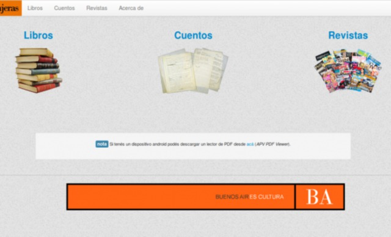

[`.org`](https://gitlab.com/osiux/osiux.gitlab.io/-/raw/master/2013-05-06-letras-viajeras.org) |
[`.md`](https://gitlab.com/osiux/osiux.gitlab.io/-/raw/master/2013-05-06-letras-viajeras.md) |
[`.gmi`](gemini://gmi.osiux.com/2013-05-06-letras-viajeras.gmi) |
[`.html`](https://osiux.gitlab.io/2013-05-06-letras-viajeras.html)

{width="640" height="388"
title="Letras Viajeras"}

****Letras Viajeras**** es una iniciativa de la ****Dirección de
Bibliotecas y Promoción de la Lectura del Gobierno de la Provincia de
Buenos Aires****, que permitirá a los pasajeros de larga y media
distancia tener acceso gratuito a libros digitales, con sus dispositivos
móviles a través de una conexión Wi-fi que permitirá descargar libros y
contenidos literarios seleccionados por la Dirección.

El material de descarga (libros, cuentos y revistas) son materiales del
dominio público y materiales liberados.

Letras Viajeras fue desarrollado íntegramente con Software Libre por la
*Cooperativa de trabajo gcoop* [^1]. La solución consiste en un Router
Inalámbrico al que se le instala `OpenWRT` [^2], un Fimware libre basado
en *Linux*.

Por otro lado se desarrolló una aplicación con `Flask` [^3] y `Boostrap`
[^4] para generar el Portal web que corre en el Router y que permite ver
y acceder a todos los materiales disponibles para descarga.

Además de la liberación del código fuente [^5] se realizó un tutorial
[^6] con el fin de que el dispositivo (sin los materiales) pueda ser
realizado por cualquier persona o institución.

[^1]: <http://gcoop.coop>

[^2]: <http://openwrt.org>

[^3]: <http://flask.pocoo.org>

[^4]: <http://twitter.github.io/bootstrap>

[^5]: <https://github.com/gcoop-libre/letras_viajeras>

[^6]: <https://github.com/gcoop-libre/letras_viajeras/blob/master/GUIA_INSTALACION.md>
