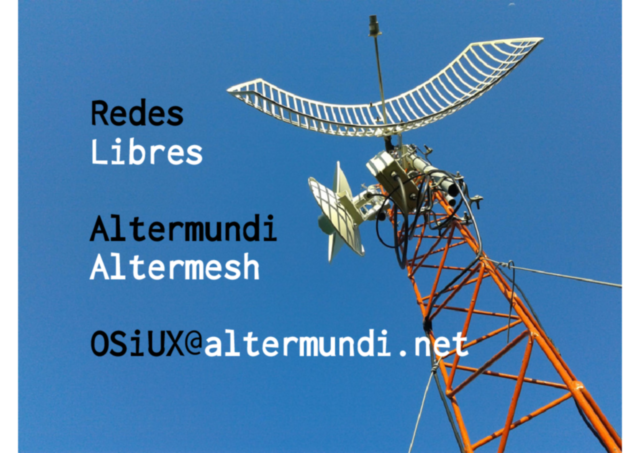

[`.org`](https://gitlab.com/osiux/osiux.gitlab.io/-/raw/master/2013-06-14-matanza-comparte-y-redes-libres-en-plaza-ciencia-2013.org) |
[`.md`](https://gitlab.com/osiux/osiux.gitlab.io/-/raw/master/2013-06-14-matanza-comparte-y-redes-libres-en-plaza-ciencia-2013.md) |
[`.gmi`](gemini://gmi.osiux.com/2013-06-14-matanza-comparte-y-redes-libres-en-plaza-ciencia-2013.gmi) |
[`.html`](https://osiux.gitlab.io/2013-06-14-matanza-comparte-y-redes-libres-en-plaza-ciencia-2013.html)

## La feria

La Secretaría de Ciencia, Tecnología y Políticas Educativas del
Municipio de la Matanza organiza la Segunda Muestra Municipal de Ciencia
y Tecnología del 12 al 19 de Junio.

<https://osiux.com/img/plaza-ciencia-2013/2013-06-14-1421-7409b1.jpg>

Donde las escuelas técnicas exponen los proyectos que realizan los
estudiantes. Es sorprendente la variedad de propuestas, desde la
fabricación de materiales de construcción a partir de objetos reciclados
de uso común.

<https://osiux.com/img/plaza-ciencia-2013/2013-06-14-1514-db3ea1.jpg>

También hubo un stand de capacitación de las diferentes herramientas
incluídas en **Huayra GNU/Linux** [^1] y de **Conectar Igualdad** [^2]

<https://osiux.com/img/plaza-ciencia-2013/2013-06-14-1447-c7b362.jpg>

Varios robots circulaban por los pasillos:

<https://osiux.com/img/plaza-ciencia-2013/2013-06-14-1518-85b0fb.jpg>

## MatanzaComparte

Los estudiantes de la *Escuela Ténica Nro 10 de Villa Madero*, a cargo
del profesor *Eduardo Sandulli* presentaron un proyecto de red libre
**MatanzaComparte** usando un panel solar para dar autonomía a un router
`TP-Link MR3020` usando **Altermesh** [^3].

<https://osiux.com/img/plaza-ciencia-2013/2013-06-14-1453-4cf1c8.jpg>

<https://osiux.com/img/plaza-ciencia-2013/2013-06-14-1454-c4e956.jpg>

<https://osiux.com/img/plaza-ciencia-2013/2013-06-14-1455-0ba838.jpg>

## Las charlas

Un extenso cronograma [^4] de charlas llenó el auditorio del evento:

<https://osiux.com/img/plaza-ciencia-2013/2013-06-14-1433-a2f579.jpg>

El viernes 14, junto a *María Elena Casañas* [^5] y *Eduardo Sandulli*
participé de un panel de **Tecnologías libres para la comunicación
soberana**, donde se charló sobre los problemas actuales de privacidad
en Internet y como contrapartida se mostró la alternativa para controlar
nuestras comunicaciones ofrecidas por modelos autogestionados de
**RedesLibres** [^6] como el caso del uso del firmware *Altermesh*
generado por Altermudi [^7].

<https://osiux.com/img/plaza-ciencia-2013/2013-06-14-1644-ddff54.jpg>

Están disponibles los slides [^8] de la presentación de RedesLibres:

[^1]: <http://huayra.conectarigualdad.gob.ar>

[^2]: <http://www.conectarigualdad.gob.ar>

[^3]: <http://docs.altermundi.net/AlterMesh/>

[^4]: <http://www.colectivocientifico.com.ar/plaza-ciencia-2013/6-programa-plaza-ciencia-2013>

[^5]: <http://www.casanas.com.ar>

[^6]: <http://www.redeslibres.org>

[^7]: <http://www.altermundi.net>

[^8]: <http://pub.osiux.com/altermundi.pdf>
