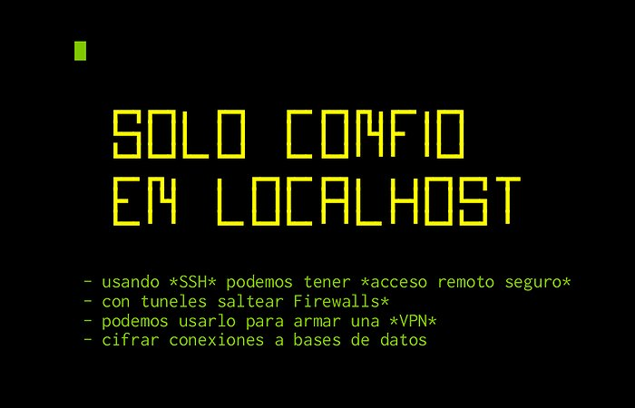
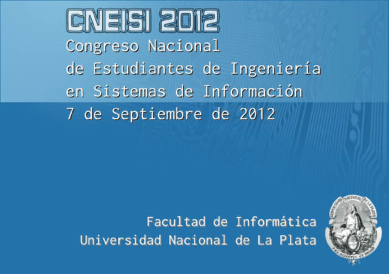

[`.org`](https://gitlab.com/osiux/osiux.gitlab.io/-/raw/master/charlas.org) |
[`.md`](https://gitlab.com/osiux/osiux.gitlab.io/-/raw/master/charlas.md) |
[`.gmi`](gemini://gmi.osiux.com/charlas.gmi) |
[`.html`](https://osiux.gitlab.io/charlas.html)

Hace varios años que doy charlas, trato de hacerlo cada vez mejor, asi
que acepto críticas y a medida que detecto posible mejoras las voy
anotando en el post:

[Tengo el título de la charla y ahora cómo hago los
slides](tengo-el-titulo-de-la-charla-y-ahora-como-hago-los-slides)

Como siempre armé mis charlas en texto plano y con alguna herramienta la
convierto en un bonito PDF o HTML, el source esta disponible en un
repositorio en <https://gitlab.com/osiux/charlas> y el resultado en
<https://pub.osiux.com/charlas>, asi que a continuación detalle un
resumen y un historial cronológico de todas ellas.

## Resumen

``` {.example}
** charlas por tag

31.58 %  31.58 %         12 ████████             redes
52.63 %  21.05 %          8 █████                coop
65.79 %  13.16 %          5 ███                  sysadmin
76.32 %  10.53 %          4 ██                   graphviz
84.21 %   7.89 %          3 ██                   privacidad
92.11 %   7.89 %          3 ██                   orgmode
94.74 %   2.63 %          1 ▌                    openvz
97.37 %   2.63 %          1 ▌                    gnu
100.00 %   2.63 %          1 ▌                    ansible
38
** charlas por año

21.43 %  21.43 %          6 █████                2011
39.29 %  17.86 %          5 ████                 2012
50.00 %  10.71 %          3 ██                   2014
60.71 %  10.71 %          3 ██                   2013
67.86 %   7.14 %          2 █                    2018
75.00 %   7.14 %          2 █                    2015
82.14 %   7.14 %          2 █                    2008
89.29 %   7.14 %          2 █                    2007
92.86 %   3.57 %          1 █                    2019
96.43 %   3.57 %          1 █                    2016
100.00 %   3.57 %          1 █                    2010
28

** meses más frecuentes

30.77 %  30.77 %          8 ███████              04
50.00 %  19.23 %          5 ████                 11
61.54 %  11.54 %          3 ███                  10
69.23 %   7.69 %          2 ██                   12
76.92 %   7.69 %          2 ██                   09
84.62 %   7.69 %          2 ██                   07
92.31 %   7.69 %          2 ██                   05
100.00 %   7.69 %          2 ██                   03
26

** eventos más frecuentes

71.43 %  71.43 %         10 █████████████████    FLISoL
85.71 %  14.29 %          2 ███                  SASOConf
100.00 %  14.29 %          2 ███                  CISL
14

** ciudades más frecuentes

42.86 %  42.86 %         15 ██████████           CABA
54.29 %  11.43 %          4 ██                   Curuzú Cuatiá
62.86 %   8.57 %          3 ██                   Argentina
68.57 %   5.71 %          2 █                    Río Gallegos
74.29 %   5.71 %          2 █                    Monte Caseros
80.00 %   5.71 %          2 █                    Bogotá
82.86 %   2.86 %          1 ▌                    Villa Madero
85.71 %   2.86 %          1 ▌                    Porto Alegre
88.57 %   2.86 %          1 ▌                    Lanús
91.43 %   2.86 %          1 ▌                    La Plata
94.29 %   2.86 %          1 ▌                    José C. Paz
97.14 %   2.86 %          1 ▌                    Berazategui
100.00 %   2.86 %          1 ▌                    Avellaneda
35
```

## 12/2019

### Centro Cultural General San Martin, CABA, Argentina

1.  PyConAR - Python Conference Argentina

1.  no podemos innovar si seguimos realizando tareas manuales
[[ansible]{.smallcaps}]{.tag tag-name="ansible"}

[](https://www.youtube.com/watch?v=f93KQ0cAbxI)

-   Slides:
<https://pub.osiux.com/charlas/no-podemos-innovar-si-seguimos-realizando-tareas-manuales-pyconcar-caba-ccgsm.pdf>
-   Video: <https://www.youtube.com/watch?v=f93KQ0cAbxI>

## 11/2018

### Universidad Nacional de José C. Paz, José C. Paz, Buenos Aires, Argentina

1.  I Jornadas \"Universidad y desarrollo local\"

1.  Cooperativismo y Software Libre [[coop]{.smallcaps}]{.tag
tag-name="coop"}

[](https://pub.osiux.com/COOPySL-UNPAZ.pdf)

-   Slides: <https://pub.osiux.com/COOPySL-UNPAZ.pdf>

## 04/2018

### Complejo Cultural Santa Cruz, Río Gallegos, Santa Cruz, Argentina

1.  Desarrollo local y nuevas tecnologías

### Universidad Nacional de la Patagonia Austral UARG, Río Gallegos, Santa Cruz, Argentina

1.  FLISoL - Festival Latinoamericano de Instalación de Software Libre

1.  Cooperativismo y Software Libre [[coop]{.smallcaps}]{.tag
tag-name="coop"}

[](https://pub.osiux.com/COOPySL-RGL.pdf)

-   Slides: <https://pub.osiux.com/COOPySL-RGL.pdf>

### Centro Cultural General San Martin, CABA, Argentina

1.  FLISoL - Festival Latinoamericano de Instalación de Software Libre

1.  Privacidad y anonimato con software libre
[[privacidad]{.smallcaps}]{.tag tag-name="privacidad"}

[](https://pub.osiux.com/privacidad-y-anonimato-con-software-libre-flisol-caba-ccgsm.pdf)

-   Slides:
<https://pub.osiux.com/privacidad-y-anonimato-con-software-libre-flisol-caba-ccgsm.pdf>

## 04/2016

### Centro Cultural General San Martín, CABA, Argentina

1.  FLISoL - Festival Latinoamericano de Instalación de Software Libre

1.  Sólo confío en localhost [[sysadmin]{.smallcaps}]{.tag
tag-name="sysadmin"}

[](https://pub.osiux.com/solo-confio-en-localhost.pdf)

-   Slides:
<https://pub.osiux.com/charlas/solo-confio-en-localhost.pdf>

## 04/2015

### Escuela Secundaria Técnica Nro. 4 de Berazategui, Berazategui, Argentina

1.  FLISoL - Festival Latinoamericano de Instalación de Software Libre

1.  Cooperativismo y Software Libre [[coop]{.smallcaps}]{.tag
tag-name="coop"}

[](http://gcoop.coop/COOPySL.pdf)

-   Slides: <https://www.gcoop.coop/COOPySL.pdf>

## 03/2015

### Casa del Bicentenario, Curuzú Cuatiá, Argentina

1.  SASOConf - Conferencia Informática Software Libre, Redes Libres y
Seguridad

1.  fast OpenVZ backups [[openvz]{.smallcaps}]{.tag
tag-name="openvz"}

[](https://pub.osiux.com/plan-b-sasoconf.pdf)

-   Slides: <https://pub.osiux.com/plan-b-sasoconf.pdf>
-   Source: <https://github.com/gcoop-libre/plan-b>

## 11/2014

### Primera Escuela de Arte Multimedial Da Vinci, CABA, Argentina

1.  AnDSeC - Security Conference

1.  Análisis de logs usando Orgmode [[orgmode]{.smallcaps}]{.tag
tag-name="orgmode"}

2.  Convertir un pcap a un grafo [[graphviz]{.smallcaps}]{.tag
tag-name="graphviz"}

## 04/2014

### Universidad Nacional de Avellaneda, Avellaneda, Argentina

1.  FLISoL - Festival Latinoamericano de Instalación de Software Libre

1.  Cooperativistas por elección, nuevas cooperativas de Tecnología
Innovación y Conocimiento [[coop]{.smallcaps}]{.tag
tag-name="coop"}

[](http://gcoop.coop/COOPySL.pdf)

-   Slides: <http://gcoop.coop/COOPySL.pdf>
-   Describir el fenómeno de nuevas cooperativas de trabajo de
jóvenes profesionales
-   Nuestra experiencia (gcoop)
-   La importancia del Software Libre
-   Nuestra visión del cooperativismo de trabajo y la tecnología
-   Software Libre y economía social

2.  Dibujando diagramas sin usar el mouse
[[graphviz]{.smallcaps}]{.tag tag-name="graphviz"}

Generación de distintos grafos como estructuras de datos,
estructuras de árbol, diagramas entidad-relación, de redes, de
flujo, etc, utilizando el conjunto de herramientas Graphviz y su
integración con otras aplicaciones. Desarrollo de scripts para
la generación automática de grafos directamente desde una
consola. Todo, para seres humanos.

[file:graficar-desde-consola.org](graficar-desde-consola)

## 03/2014

### Casa del Bicentenario, Curuzú Cuatiá, Argentina

1.  SASOConf - Conferencia Informática Software Libre, Redes Libres y
Seguridad

1.  Cooperativismo y Software Libre [[coop]{.smallcaps}]{.tag
tag-name="coop"}

[](http://gcoop.coop/COOPySL.pdf)

-   Slides: <http://gcoop.coop/COOPySL.pdf>

2.  Graficar desde consola [[graphviz]{.smallcaps}]{.tag
tag-name="graphviz"}

-   <http://osiux.com/graficar-desde-consola.html>

## 10/2013

### Biblioteca Nacional, CABA, Argentina

1.  CISL - Conferencia Internacional Software Libre

1.  Redes para todos [[redes]{.smallcaps}]{.tag tag-name="redes"}

[](https://pub.osiux.com/redes-para-todos.pdf)

-   Slides: <https://pub.osiux.com/redes-para-todos.pdf>

## 06/2013

### La Matanza, Argentina

1.  Segunda Muestra Municipal de Ciencia y Tecnología de La Matanza

1.  Tecnologías libres para la comunicación soberana redes:

-   <http://www.osiux.com/2013-06-14-matanza-comparte-y-redes-libres-en-plaza-ciencia-2013.html>

## 04/2013

### Escuela Técnica Nro 10, Villa Madero, La Matanza

1.  FLISoL - Festival Latinoamericano de Instalación de Software Libre

1.  Cooperativismo y Software Libre [[coop]{.smallcaps}]{.tag
tag-name="coop"}

[](http://gcoop.coop/COOPySL.pdf)

-   Slides: <http://gcoop.coop/COOPySL.pdf>

2.  Altermesh, libera tu red [[redes]{.smallcaps}]{.tag
tag-name="redes"}

[](https://pub.osiux.com/altermundi.pdf)

-   Slides: <https://pub.osiux.com/altermundi.pdf>
-   <http://osiux.com/2013-04-02-altermesh-buenos-aires-libre-compartir-es-bueno.html>

### CFP, CABA, Argentina

1.  Curso de Formación Profesional

1.  Administración GNU/Linux [[sysadmin]{.smallcaps}]{.tag
tag-name="sysadmin"}

-   <http://cursofp.gcoop.coop>

### Casa del Bicentenario, Monte Caseros, Argentina

1.  Primer Encuentro de Software Libre

-   <http://osiux.com/2013-04-06-primer-encuentro-software-libre-monte-caseros.html>

1.  Privacidad y Anonimato en la red [[privacidad]{.smallcaps}]{.tag
tag-name="privacidad"}

[<https://osiux.com/img/priv-y-anon.pdf>](http://youtu.be/xjxzCDmkNyQ)

-   Slides: <https://pub.osiux.com/priv-y-anon.pdf>
-   <http://osiux.com/privacidad-y-anonimato-en-la-red.html>

2.  Entendiendo la red [[redes]{.smallcaps}]{.tag tag-name="redes"}

-   <http://osiux.com/entendiendo-la-red.html>

## 10/2012

### Biblioteca Nacional, CABA, Argentina

1.  CISL - Conferencia Internacional Software Libre

1.  Redes para todos [[redes]{.smallcaps}]{.tag tag-name="redes"}

[](https://pub.osiux.com/redes-para-todos.pdf)

-   Slides: <https://pub.osiux.com/redes-para-todos.pdf>

## 09/2012

### Facultad de Informática - Universidad Nacional de La Plata, La Plata, Argentina

1.  CNEISI - Congreso Nacional de Estudiantes de Ingeniería en Sistemas
de Información

1.  Cooperativismo y Software Libre [[coop]{.smallcaps}]{.tag
tag-name="coop"}

[](http://gcoop.coop/COOPySL-CNEISI.pdf)

-   Slides: <http://gcoop.coop/COOPySL-CNEISI.pdf>

### Facultad de Ciencias Económicas - Universidad de Buenos Aires, CABA, Argentina

1.  Charlas Técnicas CaFe.IN

1.  qué hice ayer, qué tengo que hacer hoy?
[[orgmode]{.smallcaps}]{.tag tag-name="orgmode"}

-   <https://pub.osiux.com/charlas/CaFeIN-que-hice-ayer-que-tengo-que-hacer-hoy.ogv>

### Vía Libre, CABA, Argentina

1.  Taller de Comunicaciones Seguras y Software Libre

1.  Privacidad y Anonimato en la red [[privacidad]{.smallcaps}]{.tag
tag-name="privacidad"}

[](https://pub.osiux.com/priv-y-anon.pdf)

-   Slides: <https://pub.osiux.com/priv-y-anon.pdf>
-   <http://www.vialibre.org.ar/2012/08/25/15-de-septiembre-taller-de-seguridad-en-comunicaciones/>

## 07/2012

### Corferias, Bogotá, Colombia

1.  CampusParty CPCO5

1.  no seas un terminal de internet, creá una red libre
[[redes]{.smallcaps}]{.tag tag-name="redes"}

[](https://pub.osiux.com/cpco5-redlibre.pdf)

-   Slides: <https://pub.osiux.com/cpco5-redlibre.pdf>
-   Video: <http://youtu.be/IKO17A5Imbc>

## 05/2012

### Instituto Distrital de Recreación y Deporte, Bogotá, Colombia

1.  FLISoL - Festival Latinoamericano de Instalación de Software Libre

1.  Proyectos de Accesibilidad Digital y Reducción de Brecha
Tecnológica [[redes]{.smallcaps}]{.tag tag-name="redes"}

-   <https://pub.osiux.com/charlas/flisol-bogota-redes-libres.pdf>

## 04/2012

### Facultad de Ciencias Económicas - Universidad de Buenos Aires, CABA, Argentina

1.  FLISoL - Festival Latinoamericano de Instalación de Software Libre

1.  Cooperativismo y Software Libre [[coop]{.smallcaps}]{.tag
tag-name="coop"}

-   <http://gcoop.coop/COOPySL.pdf>

## 11/2011

### SysAdmin Experts, CABA, Argentina

1.  SysAdmin Experts

1.  Dame una consola [[sysadmin]{.smallcaps}]{.tag
tag-name="sysadmin"}

-   <https://pub.osiux.com/charlas/dame-una-consola-slides.pdf>

## 10/2011

### Escuela Técnica Pedro Ferré, Monte Caseros, Argentina

1.  Primera Olimpíada Interescolar Informática de Nivel Secundario

1.  Introducción a las redes [[redes]{.smallcaps}]{.tag
tag-name="redes"}

-   <https://pub.osiux.com/charlas/introduccion-a-las-redes>

## 07/2011

### Foro Internacional de Software Libre, Porto Alegre, Brasil.

1.  Terceras Jornadas Regionales de Redes Libres

1.  10 años armando una red libre en Buenos Aires
[[redes]{.smallcaps}]{.tag tag-name="redes"}

[](https://pub.osiux.com/charlas/bal-jrrl3.pdf)

-   Slides: <https://pub.osiux.com/charlas/bal-jrrl3.pdf>

## 05/2011

### Escuela Mundo Nuevo, CABA, Argentina

1.  GNU/Linux

1.  Introducción a GNU/Linux y la programación
[[sysadmin]{.smallcaps}]{.tag tag-name="sysadmin"}

-   <http://gcoop.coop/pdf/introduccion-gnu-linux-programacion.pdf>

## 04/2011

### Instituto Superior de Curuzú Cuatiá, Curuzú Cuatiá, Argentina

1.  FLISoL - Festival Latinoamericano de Instalación de Software Libre

1.  Redes Libres [[redes]{.smallcaps}]{.tag tag-name="redes"}

-   <ftp://buenosaireslibre.org/videos/flisol-2011_redes-libres_osiux_720x576.ogv>

## 11/2011

### Universidad de Lanús, Lanús, Argentina

1.  Conurbania

1.  [TODO]{.todo .TODO} TXT \| rst+org-mode
[[orgmode]{.smallcaps}]{.tag tag-name="orgmode"}

[](https://pub.osiux.com/charlas/todo-txt-rst+org-mode-slides.pdf)

-   Source: <http://osiux.com/todo-txt-rst+org-mode.org>
-   Slides:
<https://pub.osiux.com/charlas/todo-txt-rst+org-mode-slides.pdf>

## 04/2010

### Instituto Superior de Curuzú Cuatiá, Argentina

1.  FLISoL - Festival Latinoamericano de Instalación de Software Libre

1.  Dame una consola [[sysadmin]{.smallcaps}]{.tag
tag-name="sysadmin"}

-   <http://osiux.com/dame-una-consola.html>

## 11/2008

### FM LaTribu, CABA, Argentina

1.  Primer Festival de Cultura Libre y Copyleft

1.  Redes libres en Argentina [[redes]{.smallcaps}]{.tag
tag-name="redes"}

-   <http://osiux.com/redes-libres-festival-cultura-libre-fm-latribu.txt>

### Instituto Superior de Curuzú Cuatiá, Curuzú Cuatiá, Argentina

1.  Primeras Charlas Software Libre

1.  Curuzú Libre [[gnu]{.smallcaps}]{.tag tag-name="gnu"}

-   <http://osiux.com/curuzu-libre-2008.txt>

## 08/2008

### Universidad de Belgrano, CABA, Argentina

1.  Octavas Jornadas Regionales de Software Libre

1.  Graphviz: grafos y diagramas mediante código
[[graphviz]{.smallcaps}]{.tag tag-name="graphviz"}

-   <https://pub.osiux.com/graphviz-jrsl08/graphviz-jrsl08.pdf>

## 12/2007

### Instituto Tecnológico Buenos Aires, Argentina

1.  WhyFloss Conference

1.  Una red wireless comunitaria. montada sobre FLOSS
[[redes]{.smallcaps}]{.tag tag-name="redes"}

[](https://pub.osiux.com/charlas/WhyFLOSS-2007-BuenosAiresLibre.pdf)

-   <https://pub.osiux.com/charlas/WhyFLOSS-2007-BuenosAiresLibre.pdf>

## 09/2007

### Facultad de Ingeniería Universidad de Buenos Aires, CABA, Argentina

1.  Jornadas 2007

1.  Buenos Aires Libre: una. red wireless comunitaria
[[redes]{.smallcaps}]{.tag tag-name="redes"}

[](https://pub.osiux.com/charlas/lugfi-jornadas-2007/presentacion-bal.pdf)

-   Slides:
<https://pub.osiux.com/charlas/lugfi-jornadas-2007/presentacion-bal.pdf>
