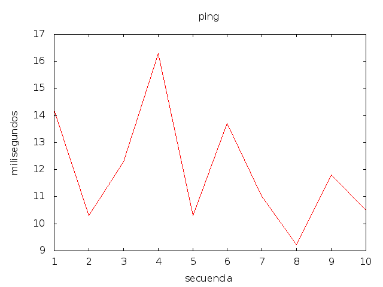
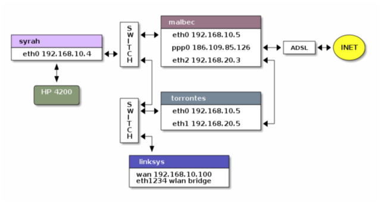

[`.org`](https://gitlab.com/osiux/osiux.gitlab.io/-/raw/master/dame-una-consola.org) |
[`.md`](https://gitlab.com/osiux/osiux.gitlab.io/-/raw/master/dame-una-consola.md) |
[`.gmi`](gemini://gmi.osiux.com/dame-una-consola.gmi) |
[`.html`](https://osiux.gitlab.io/dame-una-consola.html)


## qué és una consola?

-   Suele usarse indistintamente el termino shell, terminal, emulador de
terminal, intérprete de comandos.
-   Se puede decir que es una interface de texto que permite ingresar
instrucciones a un programa informático.

## porqué usar la consola?

-   Uno de los principales beneficios es la automatización de las
tareas.
-   Es la interconexión de comandos la mayor ventaja, ya que esto
permite escribir rápidamente soluciones que no tienen una aplicación
específica que las resuelva.
-   Está siempre disponible en todas las distribuciones de GNU/Linux,
BSD, Unix, etc.

## todo es un archivo

En sistemas `*nix` todo es un archivo, es decir todos los dispositivos,
las particiones de disco, CDs, diskettes, tarjeta de sonido, video, etc.

## permisos

``` {.example}
r = read        4
w = write       2
x = execute     1
```

``` {.example}
# usuario y grupo todo, el resto nada.
770   rwxrwx--
# solo dueño y grupo leer y ejecutar.
550   r-xr-x--
# solo dueño tiene escritura, todos pueden leer.
644   rw--r--r
```

## comandos básicos

--------- ---------------------------------------
`man`     leer el manual, es el mas importante!
`echo`    eco, imprime texto en pantalla
`ls`      listar archivos y directorios
`pwd`     mostrar directorio actual
`cd`      cambiar directorio
`cp`      copiar
`rm`      borrar
`mv`      mover
`mkdir`   crear directorio
`cat`     muestra contenido de un archivo
--------- ---------------------------------------

## más comandos

--------- -------------------------------------
`more`    pagina la salida de un archivo
`sort`    ordena
`wc`      cuenta cantidad líneas y palabaras
`grep`    filtra un texto
`sed`     editor de texto en línea
`awk`     procesa texto
`find`    busca archivos
`chmod`   cambia permisos
`chown`   cambia el propietario de un archivo
`alias`   define un alias para un comando
`ps`      muestra procesos en ejecucion
--------- -------------------------------------

## stdinput

En lugar de tipear podemos enviar un archivo como la entrada estandard
de un comando:

``` {.example}
mail osiux@osiux.com.ar < archivo.txt
```

## stdoutput

Podemos almacenar en un archivo el resultado de la ejecución de un
comando:

``` {.bash org-language="sh" exports="code"}
# sobreescribe
ls *.png >lista.txt
# agrega
ls *.txt >>lista.txt
```

## pipe

Convertir la salida standard de un comando en la entrada standard de
otro comando permite conectar procesos:

``` {.bash org-language="sh" exports="code"}
ls | sort
```


## expresiones regulares

--------- -------------------------------
`[a-z]`   rango de la **a** a la **z**
`[A-Z]`   rango de la **A** a la **Z**
`[0-9]`   rango de 0 a 9
`[^..]`   negación
`^`       principio de línea
`$`       fin de línea
`.`       cualquier caracter
`?`       cero o una aparición
`*`       ninguna o muchas repeticiones
`+`       una o mas repeticiones
--------- -------------------------------

## aplicaciones

``` {.example}
mutt, pine, fetchmail
reminder, wyrd
vim, emacs, joe, nano, mcedit, vim-outliner
w3m, lynx, elinks, rtorrent, newsbeuter
freetalk, cabber, irssi, weechat, center-im
moc, rippit, aumix, alsamixer
ftp, ncftp, wget, httrack
mc, rsync, rdiff-backup
vlc, mplayer
```

## más aplicaciones

``` {.example}
ssh, telnet, screen, ajaxterm
tig, git, svn, bzr, mercurial
mysql, msqldump
python, ipython, bpython
graphviz, imagemagick, gnuplot
parted, testdisk, dd, partimage
gnupg, dmsetup, bcrypt, truecrypt
htop, ethtool, netcat, nmap, wicd-curses
diff, patch, make, base64, vim-diff
vnstat, iftop, nload, wicd-curses
pdf2text, html2text, python-docutils, rst2pdf
```

## ejemplos

``` {.bash org-language="sh" exports="code"}
# cuál es mi ip?
ip r | grep -o src.[0-9.]+ | awk '{print $2}'
# cuál es mi mac?
ifconfig eth0 | grep HWaddr | awk '{print $5}'
# sé la mac, pero cúal es la ip?
tcpdump -ennqti eth0 \( arp or 600pxp \) | grep "48:5b:39:6e:f4:d4"
# encender la compu remotamente
wakeonlan 48:5b:39:6e:f4:d4
# quíen está consumiendo todo el ancho de banda?
iftop -i eth0
# ips entregadas por dhcp?
egrep -o "[0-9]+>[0-9]+>[0-9]+>[0-9]+" dhcpd.leases | uniq | wc -l
# obtener una línea específica de un archivo
head -30 /var/log/messages | tail -1
# reemplazar texto en varios archivos
find -name '*.php' | while read i;do cat $i | \
sed s/GNU/GPL/g >$i.tmp;cat $i.tmp>$i;done
```

## más ejemplos

``` {.bash org-language="sh" exports="code"}
# buscar en el contenido de una web
w3m -dump http://barrapunto.com | grep -i -C2 android
w3m -dump http://debian.org/News | grep -i squeeze | grep frozen >/tmp/debian
# notificar estado batería
if [ "$BAT_STATUS" = "Discharging" ];then \
if [ $BAT_PERCENT -le 25 ];then \
notify-send -u critical "$MSG" "$BAT_PERCENT";fi
else;notify-send "$MSG";fi
```

## vim

------- -------------------------------
`Esc`   cambia a modo visual
`a`     agregar texto posición actual
`A`     agregar texto al final línea
`i`     inserta en la posición actual
`I`     inserta al inicio de la línea
`r`     reemplazar un caracter
`R`     modo reemplazar
`x`     borra caracter a la derecha
`X`     borra caracter a la izquierda
`y`     copiar
`p`     pegar
------- -------------------------------

## más vim

--------- --------------------------------
`d`       eliminar
`.`       repite última función
`:`       cambia a modo comando
`:q`      salir si no hubo cambios
`:q!`     salir sin guardar cambios
`:wq`     guardar y salir
`:e`      editar archivo
`:.`      línea actual
`:1,.`    desde primer línea a la actual
`:.,$`    desde línea actual a la última
`:5,15`   desde línea 5 a la número 15
--------- --------------------------------

## telnet mail

``` {.example}
telnet localhost 25
HELO branca.osiux.com.ar
MAIL FROM: osiris@branca.osiux.com.ar
RCPT TO: osiux@branca.osiux.com.ar
DATA
Subject: prueba correo local usando telnet
nero cuando nos tomamos unos fernets?
.
250 2.0.0 Ok: queued as 6626586DE6
QUIT
```

## telnet web

``` {.example}
telnet google.com 80
Trying 209.85.195.104...
Connected to google.com.
GET /
HTTP/1.0 302 Found
Location: http://www.google.com.ar/
Content-Type: text/html; charset=UTF-8
<HTML><HEAD><TITLE>302 Moved</TITLE></HEAD><BODY>
<H1>302 Moved</H1>The document has moved
<A HREF="http://www.google.com.ar/">here</A>.
</BODY></HTML>
Connection closed by foreign host.
```

## mysql + bash

``` {.bash org-language="sh" exports="code"}
# Definir Alias
set alias sugar='mysql --default-character-set=utf8 -u sugar -psugar -B sugar'

# Ejecutar consulta
echo "SELECT user_name FROM users WHERE is_admin = 1;" | sugar

# Listado de Tablas
set alias tablas='echo "show tables" | sugar | grep -v Tables_in | sort -u'

# Listado Tabla Campo
set alias tablacampos='echo "show tables" | sugar | grep -v Tables_in | \
while read t; do d=$(echo "desc "$t";" | cct15 | grep -v Field | awk1); \
for c in $d;do echo $t"__"$c;done ;done'

# Vaciar todas las tablas que contengan la palabra *calls*
sugar < $(echo "show tables" | sugar | grep calls | \
while read t;do echo "TRUNCATE table $t;";done)
```

## mysql + vim

-   Conexión en `.vimrc`

``` {.example}
command -range=% Q :<line1>,<line2>w !mysql -u sugar -psugar -B sugar -t -v -v -v
```

-   Ejecutar todo el archivo

``` {.example}
:Q
```

-   Ejecutar la línea actual

``` {.example}
:. Q
```

-   Ejecutar un rango de líneas

``` {.example}
:3,8 Q
```

-   Ejecutar desde línea actual hasta el final

``` {.example}
:.,$ Q
```

-   Usar diccionarios `CTRL-X CTRL-K`

``` {.example}
:set dictionary=tablas, tablacampo
```

## imagemagick

``` {.bash org-language="sh" exports="code"}
c=0;ls | grep jpg | while read f; \
do mv -v $f $'monte-hermoso-2010-'$c$'.jpg'; \
c=$[$c+1];done

for i in *.jpg
do
convert -filter cubic -resize 640 $i 640-$i
done
```

## graphviz

``` {.dot exports="code"}
digraph topology {
"10.4.14.225" [color=red]; "10.4.14.33" [color=orange];
"10.4.14.161" [color=yellow]; "172.16.169.52" [color=red];
"172.16.169.55" [color=orange]; "10.4.14.34" [color=yellow];
"172.16.169.52" [color=red]; "10.4.10.1" [color=orange];
"10.4.14.225" -> "10.4.14.33"[label="1.08", style=solid];
"10.4.14.225" -> "10.4.14.161"[label="1.20", style=solid];
"10.4.14.225" -> "172.16.169.52"[label="1.37", style=solid];
"10.4.14.225" -> "172.16.169.55"[label="1.26", style=solid];
"10.4.14.225" -> "10.4.14.34"[label="1.11", style=solid];
"10.4.10.1" -> "10.4.14.34"[label="1.07"];
"172.16.169.52" -> "10.4.14.225"[label="1.36"];
"172.16.169.52" -> "10.4.14.161"[label="1.00"];
"172.16.169.52" -> "172.16.169.55"[label="1.11"];
"10.4.14.161" -> "172.16.169.52"[label="1.00"];
"10.4.14.161" -> "172.16.169.55"[label="1.00"];
"10.4.14.161" -> "10.4.14.188"[label="1.00"];
"10.4.14.161" -> "10.4.14.225"[label="1.23"];
"10.4.14.33" -> "10.4.12.161"[label="4.18"];
"10.4.14.33" -> "10.4.14.225"[label="1.08"];
"10.4.14.33" -> "10.4.14.34"[label="1.00"]; }
```

``` {.bash org-language="sh" exports="code"}
dot -Tpng grafo.dot >grafo.png
```


## gnuplot

``` {.bash org-language="sh" exports="code"}
ping -c10 google.com | grep 600pxp_seq" \
| tr "=" " " | awk '{print $7,$11}' >ping.dat

echo 'set title "ping" \
set xlabel "milisegundos" \
set ylabel "secuencia" \
set term png \
set output "ping.png" \
plot "ping.dat" using 1:2 with lines \
quit ' >ping.plt

gnuplot ping.plt
```



## ditaa

``` {.ditaa exports="code"}
+---------------------+
+---+    | malbec         c978 |
| S |    +---------------------+
+-------------------+   | W |<-->| eth0 192.168.10.5   |               +------+
| syrah        cDBF |   | I |    |                     |    +------+   | cYEL |
+-------------------+   | T |    | ppp0 186.109.85.126 |<-->| ADSL |<->| INET |
| eth0 192.168.10.4 |<->| C |    |                     |    +------+   |  {o} |
+-------------------+   | H |<-+ | eth2 192.168.20.3   |<-+            +------+
^             +---+  | +---------------------+  |
|                    |                          |
v                    |                          |
/---------\               |                          |
| HP 4200 |               | +---------------------+  |
|  c897   |        +---+  | | torrontes      c789 |  |
\---------/        | S |<-+ +---------------------+  |
| W |<-->| eth0 192.168.10.5   |  |
| I |    |                     |  |
| T |    | eth1 192.168.20.5   |<-+
| C |    +---------------------+
| H |<-+
+---+  |
```



## rst2pdf

``` {.bash org-language="sh" exports="code"}
rst2pdf dame-una-consola.txt
rst2pdf -s style -b 1 dame-una-consola.txt
```

## Dudas y comentarios

-   osiris\@gcoop.coop Cualquier duda pueden consultar por email,
prometo responder lo antes posible.
-   <http://pub.osiux.com/charlas> Pueden descargar ésta y otras
charlas, incluído el código fuente CC-BY-SA.
-   <http://pub.osiux.com/charlas/dame-una-consola-slides.pdf>
-   <http://osiux.com> Mucha data útil (muy poco de mi autoría),
archivos `TXT` en formato `re-StructuredText`.


## ChangeLog

-   [`2019-04-18 00:21`](https://gitlab.com/osiux/osiux.gitlab.io/-/commit/e46ec52748a7ecc60f09c3b95e363e92eaa0bebc)
Agregar hora en header date
-   [`2019-04-18 00:01`](https://gitlab.com/osiux/osiux.gitlab.io/-/commit/5c8643b83930c6269569c76602608bd33f93008b)
Corregir identación header \#+INCLUDE:
-   [`2015-07-03 04:31`](https://gitlab.com/osiux/osiux.gitlab.io/-/commit/bbc3bbc728f2a3eeb4fe2e0a012ee5d8d613e3ef)
@ 00:05 hs - elimino \#+OPTIONS: de todos los archivos excepto
header.org
-   [`2014-04-22 11:35`](https://gitlab.com/osiux/osiux.gitlab.io/-/commit/74165280ffad770d1f8b8acbfa7f22b95459b52a)
@ 00:34 hs - Agrego timestamp:nil
-   [`2013-04-24 08:04`](https://gitlab.com/osiux/osiux.gitlab.io/-/commit/5ad3755a3df07cdfbdc75d56cae06db2fee4b5f2)
@ 01:50 hs - migro a org 8.0
-   [`2013-03-21 02:27`](https://gitlab.com/osiux/osiux.gitlab.io/-/commit/e4dc30e2a202e7ad44bddc761065e9aeb0a31bd3)
@ 01:58 hs - agrego cambios según git.osiux.com
