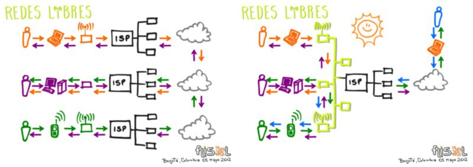

[`.org`](https://gitlab.com/osiux/osiux.gitlab.io/-/raw/master/flisol-bogota-2012.org) |
[`.md`](https://gitlab.com/osiux/osiux.gitlab.io/-/raw/master/flisol-bogota-2012.md) |
[`.gmi`](gemini://gmi.osiux.com/flisol-bogota-2012.gmi) |
[`.html`](https://osiux.gitlab.io/flisol-bogota-2012.html)

## largo viaje

Luego de 9hs de vuelo y una escala de 4hs en Panamá llegué a Bogotá.

[](https://osiux.com/img/flisol-bogota/viaje-ezeiza-partida.jpg)

[](https://osiux.com/img/flisol-bogota/panama-hora.jpg)

[](https://osiux.com/img/flisol-bogota/panama-tocumen.jpg)

[](https://osiux.com/img/flisol-bogota/panama-wifi.jpg)

[](https://osiux.com/img/flisol-bogota/panama-canal.jpg)

[](https://osiux.com/img/flisol-bogota/viaje-colombia-avion.jpg)

[](https://osiux.com/img/flisol-bogota/viaje-colombia-nubes.jpg)

[](https://osiux.com/img/flisol-bogota/viaje-colombia-bienvenido.jpg)

Inicialmente la primera impresión de estar en un lugar completamente
nuevo es muy entretenida, hay mucho por ver y entender. Fui recibido por
**Jorge Rojas** integrante de **BogotáMesh** quien me alojó y se excedió
en anfitrión y guía turístico!

## ciudad bolivar

El primer día comenzamos la recorrida directamente por **Ciudad
Bolivar** [^1] viendo algunos de los nodos de **BogotaMesh** y buscando
un punto alto para poder ver una sorprendente panorámica de la ciudad,
pasando por la estación de **Televisión Comunitaria Canal5** [^2] en
barrio **La Estrella**.

[](https://osiux.com/img/flisol-bogota/ciudad-bolivar-1.jpg)

[](https://osiux.com/img/flisol-bogota/ciudad-bolivar-2.jpg)

[](https://osiux.com/img/flisol-bogota/ciudad-bolivar-nodo-1.jpg)

[](https://osiux.com/img/flisol-bogota/ciudad-bolivar-nodo-2.jpg)

[](https://osiux.com/img/flisol-bogota/ciudad-bolivar-jorge-osiux.jpg)

[](https://osiux.com/img/flisol-bogota/ciudad-bolivar-tv-antena.jpg)

[](https://osiux.com/img/flisol-bogota/ciudad-bolivar-tv-racks.jpg)

[](https://osiux.com/img/flisol-bogota/ciudad-bolivar-tv-estudio.jpg)

[](https://osiux.com/img/flisol-bogota/ciudad-bolivar-tv-programa.jpg)

[](https://osiux.com/img/flisol-bogota/ciudad-bolivar-tv-graffiti.jpg)

[](https://osiux.com/img/flisol-bogota/ciudad-bolivar-panoramica-1.jpg)

[](https://osiux.com/img/flisol-bogota/ciudad-bolivar-panoramica-2.jpg)

## primer noche

La primer noche fue para conocer a otros integrantes de BogotaMesh que
estaban muy bien acompañados! y comenzar a compartir diferentes
experiencias de redes libres y obviamente disfrutar de unas cervezas!

[](https://osiux.com/img/flisol-bogota/bogota-noche-1.jpg)

[](https://osiux.com/img/flisol-bogota/bogota-noche-2.jpg)

[](https://osiux.com/img/flisol-bogota/bogota-noche-3.jpg)

## día **F**

Muy temprano partimos para el **Instituto Distrital de Recreación y
Deporte** [^3] donde se montó el evento. Aproveché la mañana para
rehacer mi presentación ya que justo antes de partir desde Buenos Aires
borré accidentalmente los archivos! por suerte contaba con backup, luego
de un panic attack pude reconstruirla y de paso readaptarla cambiando
por completo la estructura inicial y las aplicaciones involucradas que
serán motivo de una nota especial a futuro.

[](https://osiux.com/img/flisol-bogota/flisol-idrd.jpg)

[](https://osiux.com/img/flisol-bogota/flisol-cartel.jpg)

[](https://osiux.com/img/flisol-bogota/flisol-auditorio.jpg)

[](https://osiux.com/img/flisol-bogota/flisol-banderas.jpg)

[](https://osiux.com/img/flisol-bogota/flisol-alcalde.jpg)

[](https://osiux.com/img/flisol-bogota/flisol-mesas.jpg)

[](https://osiux.com/img/flisol-bogota/flisol-compus.jpg)

[](https://osiux.com/img/flisol-bogota/flisol-stand.jpg)

[](https://osiux.com/img/flisol-bogota/flisol-hackbo.jpg)

[](https://osiux.com/img/flisol-bogota/flisol-robot.jpg)

## en la radio

Mientras ajustaba detalles de los slides, de la organización del FLISOL
me acercaron a periodistas de Radio LAUD [^4], quienes realizaron una
entrevista sobre software libre, redes libres y cultura libre, aunque no
escuché el audio espero haber sido coherente :-)

## doctor fundador

En el auditorio mayor encontré en primera fila una silla con mi nombre y
dos sorpresas: al parecer soy **doctor** y por si fuera poco
**fundador** de BuenosAiresLibre.org [^5]

[](https://osiux.com/img/flisol-bogota/flisol-doctor-fundador.jpg)

No tengo doctorado pero me halagan! Y en cuanto a BAL, si consideramos
que una red se funda todos los días con la participación activa no
estaría mal, pero debo reconocer que me inicié activamente en el
proyecto el 2 de diciembre del 2006 según consta en el wiki [^6]

## el software libre tiene Alcalde en Bogotá

Luego de escuchar los Himnos de Colombia y Bogotá tomó la palabra el
**Alcalde Mayor de Bogotá**, Gustavo Petro [^7] quién ofreció un
interesante discurso en relación a **compartir el conocimiento** y las
políticas de software libre que se están llevando a cabo por medio de la
Administración de Bogotá, entre ellas a destacar el plan de llevar fibra
óptica a toda la ciudad comenzando por colegios y hospitales con un
ancho de banda de 100 mbits.

Está disponible el video del discurso de apertura:

[](http://youtu.be/_IcH8F_iDTg)

Acto seguido **Farid Amed** habló del compromiso de la comunidad del
software libre que está luchando por una cultura libre.

Finalmente el anuncio de brindar acceso a internet gratuito por medio de
una red inalámbrica.

## conferencia magistral

Sobre la hora terminé de rehacer la presentación y comencé la
conferencia titulada \*Proyectos de Accesibilidad Digital y Reducción de
Brecha Tecnologica. Abordando el caso de las Redes Inalambricas
Comunitarias de Argentina\* que simplifiqué en **Redes Libres**.

Luego de una muy breve presentación, para romper el hielo ante un
auditorio de unas 200 personas aproximadamente, obsequié 2 libros de
*Redes Inálambricas en Países en Desarrollo* [^8] a aquellos que se
animaron a contestar cuáles eran las **4 libertades del software libre**
y qué son las **redes libres!**

La charla fue bastante rica en preguntas de los asistentes quienes
quedaron encantados con la presentación [^9] la cual comparto:

[](http://pub.osiux.com/charlas/flisol-bogota-redes-libres.pdf)

Aunque me quedaron truncados varios slides, la iré corrigiendo ni bien
pueda.

```{=html}
<video controls="controls" src="http://pub.osiux.com/charlas/FLISOL-Bogota-2012-Redes-Libres.ogv"></video>
```
-   Descargar Video:
<http://pub.osiux.com/charlas/FLISOL-Bogota-2012-Redes-Libres.ogv>

## a debatir!

Mientras estaba hablando con *Andrés Gómez* de la *Red Inalámbrica y
Comunitaria de Bogotá* [^10], nuevamente la organización del evento me
invitó a participar de un panel sobre **Aportes a una Política Pública
Tecnológica Libre en Bogotá** junto a Concejales de Bogotá, y el resto
de invitados internacionales:

-   Hugo Baronti, Chile
-   Rafael Bonifaz, Ecuador
-   Hector Colina, Venezuela
-   Roberto Sanz, Bogotá

Lamentablemente tuve que abandonar el panel a la mitad para asistir al
foro de redes libres, pero antes de irme logré plantear la necesidad de
contar no sólo con infraestructura de red propia en la ciudad, además
expresé la importancia de contar con servicios para la red dentro de los
límites geográficos de Bogotá a fin de garantizar la autonomía,
privacidad y soberanía de los datos, destacando la posibilidad de cubrir
zonas rurales donde las empresas de comunicaciones no las consideran
rentables y por ende las dejan aisladas, cuando con software libre es
posible resolver problemas puntuales mediante telefonía VOIP por dar un
ejemplo.

La calidad de los oradores fue excelente y espero ver el debate
completo, el mismo fue transmitido en vivo y se puede ver en:

[](http://www.ustream.tv/recorded/22379626)

## foro de redes libres

En la carpa exterior, se organizó un foro titulado \*MECANISMOS
COMUNITARIOS PARA LA ACCESIBILIDAD DE LA INFORMACIÓN CON WIFI ABIERTA\*
donde participaron las distintas redes libres de Colombia, muchas de las
cuales están comenzando con mucho entusiasmo y con una idea muy clara
sobre el impacto social que logran más allá de las diferencias
particulares de cada red, en su mayoría todas adhieren al **Manifiesto
de Redes Libres** [^11] redactado en las Segundas Jornadas de Redes
Libres que se realizaron en Uruguay y aprobado en las Terceras Jornadas
de Redes Libres en el Foro Internacional de Software Libre en Brasil.

Ademas de mi representación por BuenosAiresLibre, QuintanaLibre y
DeltaLibre de Argentina, las redes participantes de Colombia fueron:

-   BogotaMesh, <http://bogota-mesh.org>
-   CaribeMesh, <http://caribemesh.org>
-   Espinal, <http://espinal.redlibre.co>
-   FUSA, <http://fusa.redlibre.co>
-   Girardot
-   RICB, <http://ricb.org>
-   Valledupar-Mesh

[](https://osiux.com/img/flisol-bogota/foro-redes-libres-general.jpg)

[](https://osiux.com/img/flisol-bogota/foro-redes-libres-hollman.jpg)

[](https://osiux.com/img/flisol-bogota/foro-redes-libres-gral-0.jpg)

[](https://osiux.com/img/flisol-bogota/foro-redes-libres-gral-1.jpg)

[](https://osiux.com/img/flisol-bogota/foro-redes-libres-gral-2.jpg)

[](https://osiux.com/img/flisol-bogota/foro-redes-libres-gral-3.jpg)

Se planteó la posibilidad de agrupar a las distintas redes en
*RedLibre.co* [^12] como comunidad para la interoperabilidad de todas
las redes libres actuales y futuras dentro del territorio Colombiano.

El tiempo se acortó bastante pero se logró intercambiar mucha
información y se realizó la invitación a participar de las Cuartas
Jornadas Regionales de Redes Libres a realizarse a fin de Junio en
Bogotá.

## cena en centro mayor

Invitado por entusiastas de redes libres, conocí el shopping Centro
Mayor donde además de disfrutar de comida típica de Colombia pudimos
charlar más distendidos sobre diversos temas como privacidad en la red,
hardware libre.

[](https://osiux.com/img/flisol-bogota/centro-mayor-1.jpg)

[](https://osiux.com/img/flisol-bogota/centro-mayor-2.jpg)

[](https://osiux.com/img/flisol-bogota/centro-mayor-3.jpg)

## el festejo

Luego de tan agitado día era necesario festejar y matar algunas neuronas
con cerveza y aguardiente a fin de relajarse un poco dejando de lado los
dilemas y conflictos que enfrentamos a diario para mover un poco las
caderas!

[](https://osiux.com/img/flisol-bogota/sunrise-cerveza.jpg)

[](https://osiux.com/img/flisol-bogota/sunrise-grupal1.jpg)

[](https://osiux.com/img/flisol-bogota/sunrise-grupal2.jpg)

[](https://osiux.com/img/flisol-bogota/sunrise-aguardiente.jpg)

[](https://osiux.com/img/flisol-bogota/sunrise-andres.jpg)

[](https://osiux.com/img/flisol-bogota/sunrise-aleja.jpg)

[](https://osiux.com/img/flisol-bogota/sunrise-azul.jpg)

[](https://osiux.com/img/flisol-bogota/sunrise-sunrise.jpg)

## asado y nuevo nodo

Para aprovechar el domingo, mientras varios ingenieros descifraban los
secretos de enceder fuego para luego disfrutar de un rico asado
colombiano, se trabajó en levantar un nodo en **Candelaria** que es
parte de Ciudad Bolivar. Inicialmente se flasheó una NanoStation con
Nightwing para luego estrenar el firmware CloudMesh. Como siempre la
mayor tarea de levantar un nodo consiste en logística y muchas tareas
manuales para fijar el mástil, los equipos y realizar el tendido de
UTP+PoE. Luego de una prueba en la base que confirmaba la correcta
configuración del AccessPoint se procedió a levantar el nodo mediante un
caño de 3 metros adicionando una omni de 15dbi que ni bien ganó altura,
BATMAN hizo su magia y se enlazó automágicamente a un nodo existente de
BogotaMesh. Los aplausos no tardaron en llegar y luego de unos test de
velocidad, ancho de banda y acceso a servicios internos como en internet
pudimos disfrutar de la segunda y tercer tanda de asado y espumosas
cervezas!

[](https://osiux.com/img/flisol-bogota/perzam-poker.jpg)

[](https://osiux.com/img/flisol-bogota/perzam-asado.jpg)

[](https://osiux.com/img/flisol-bogota/perzam-grupal.jpg)

[](https://osiux.com/img/flisol-bogota/perzam-nightwing.jpg)

[](https://osiux.com/img/flisol-bogota/perzam-cloud-mesh.jpg)

[](https://osiux.com/img/flisol-bogota/perzam-redlibre.co.jpg)

[](https://osiux.com/img/flisol-bogota/perzam-pre-ereccion.jpg)

[](https://osiux.com/img/flisol-bogota/perzam-ereccion.jpg)

[](https://osiux.com/img/flisol-bogota/perzam-enlace.jpg)

[](https://osiux.com/img/flisol-bogota/perzam-nodo.jpg)

[](https://osiux.com/img/flisol-bogota/perzam-festejo.jpg)

[](https://osiux.com/img/flisol-bogota/perzam-chicas.jpg)

## en el punto más alto

En una lluviosa mañana fuimos al monte Monserrate [^13], ascendimos 200
metros y paseamos un poco, lamentablemente habían tantas nubes que no se
podía ver nada de la ciudad.

[](https://osiux.com/img/flisol-bogota/monserrate-campanario.jpg)

[](https://osiux.com/img/flisol-bogota/monserrate-osiux-jorge.jpg)

[](https://osiux.com/img/flisol-bogota/monserrate-subida.jpg)

[](https://osiux.com/img/flisol-bogota/monserrate-turistas.jpg)

[](https://osiux.com/img/flisol-bogota/monserrate-iglesia.jpg)

[](https://osiux.com/img/flisol-bogota/monserrate-bajando.jpg)

[](https://osiux.com/img/flisol-bogota/monserrate-teleferico.jpg)

[](https://osiux.com/img/flisol-bogota/monserrate-cascada.jpg)

## hacklab

En las últimas horas aprovechamos para hacer un **hacklab**,
inicialmente di una charlita de **anonimato y privacidad en la red**
donde básicamente hablé de tuneles ssh, tor y cifrado. Luego estuvimos
configurando algunos equipos para formar parte de **LibreVPN** [^14] y
compartir tráfico entre las distintas redeslibres que están formando
parte del proyecto.

## ChangeLog

-   \[2013-05-10 vie\] migro de formato rST a Org
-   \[2015-07-18 sáb\] elimino atributos width y height de imágenes y
cambio previews

[^1]: [https://es.wikipedia.org/wiki/Ciudad\_Bolívar\_(Bogotá)](https://es.wikipedia.org/wiki/Ciudad_Bolívar_(Bogotá))

[^2]: <http://tucanal5.com/>

[^3]: <http://www.idrd.gov.co>

[^4]: <http://laud.udistrital.edu.co>

[^5]: <http://buenosaireslibre.org>

[^6]: <http://wiki.buenosaireslibre.org/Reuniones/Organizativas/2006-Diciembre-2>

[^7]: <http://www.gustavopetro.com>

[^8]: <http://wndw.net>

[^9]: <http://pub.osiux.com/charlas/flisol-bogota-redes-libres.pdf>

[^10]: <http://ricb.org>

[^11]: <http://redeslibres.org/es/manifiesto-de-las-redes-libres>

[^12]: <http://redlibre.co>

[^13]: [https://es.wikipedia.org/wiki/Teleférico\_a\_Monserrate](https://es.wikipedia.org/wiki/Teleférico_a_Monserrate)

[^14]: <https://kiwwwi.com.ar/librevpn/>
