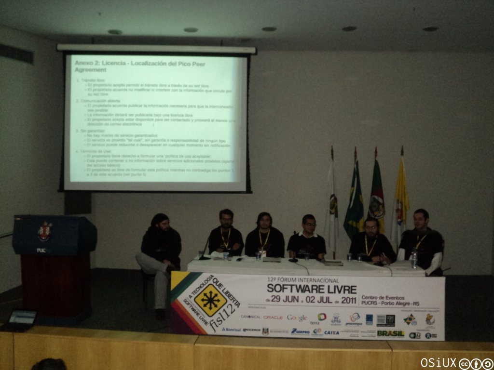
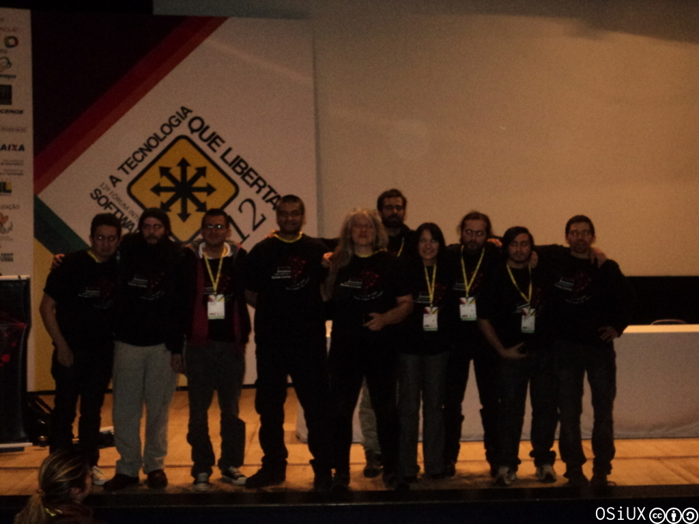
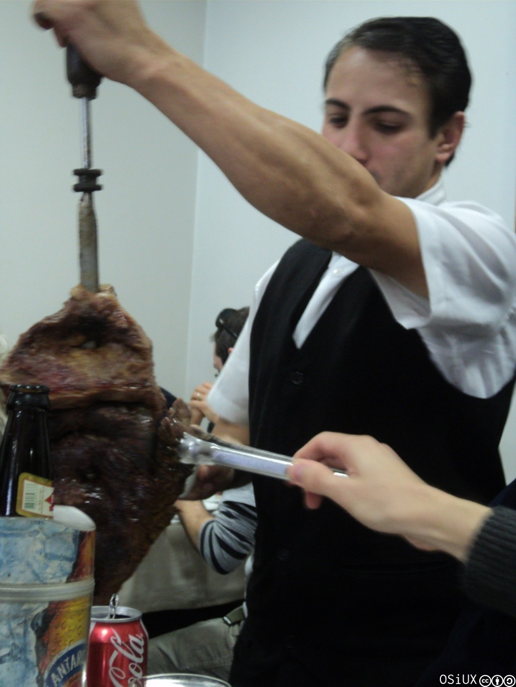
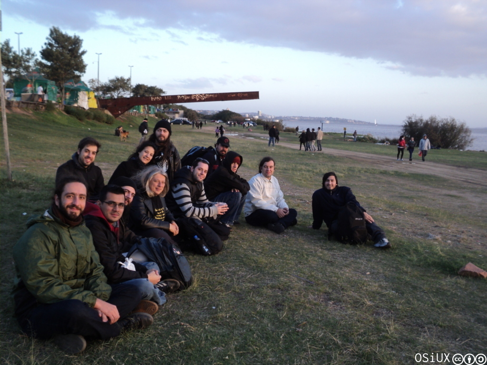

[`.org`](https://gitlab.com/osiux/osiux.gitlab.io/-/raw/master/jrrl3-terceras-jornadas-regionales-de-redes-libres-en-fisl12.org) |
[`.md`](https://gitlab.com/osiux/osiux.gitlab.io/-/raw/master/jrrl3-terceras-jornadas-regionales-de-redes-libres-en-fisl12.md) |
[`.gmi`](gemini://gmi.osiux.com/jrrl3-terceras-jornadas-regionales-de-redes-libres-en-fisl12.gmi) |
[`.html`](https://osiux.gitlab.io/jrrl3-terceras-jornadas-regionales-de-redes-libres-en-fisl12.html)

## La previa

El jueves por la noche, empezamos en el hostel con la revisión del
**manifiesto**, en plena discusión tuvimos que buscar un nuevo lugar, ya
era tarde para estar en el patio (al parecer hacíamos mucho ruido ¿?) y
salimos para terminar en una pizzería, donde nos habilitaron un patio y
estuvimos varias horas, hasta la madrugada. Inicialmente el conflicto
comenzó por el significado de **principalmente es meramente económico**,
descubrimos que los distintos países daban una connotación distinta,
teníamos diferencias semánticas e idiomáticas, seguidamente fueron
surgiendo situaciones similares, para terminar decidiendo **aprobar en
general el manifiesto** ya que todos estábamos de acuerdo y que
finalmente podíamos resolver en la lista redeslibres\@altermuni.net el
texto definitivo adecuándolo no sólo a cada idioma sino también a cada
región si fuera necesario.


## Apertura

\"Esta es la tercera jornada de las redes, donde nos encontramos para
hablar de las redes, de buscar ideas comunes por las redes, acá estamos
los representantes de cada grupo, la idea es hablar de lo que estamos
hablando entre nosotros, del **manifiesto** de lo que pensamos para las
redes libres para nuestro gran continente que es Sudamérica. En las
segundas jornadas pensábamos qué tenemos en común qué buscamos nosotros
por las redes, empezamos allá en Uruguay, en Tacuarembó una charla, cómo
buscar un sentido común, cómo mostrar a los otros qué es una red libre,
qué diferencia de una red privada de una red pública y por qué ... y así
estamos como hace tres meses escribiendo en una lista de correo que es
la lista de redeslibres, ahí buscamos por un censo común entre nosotros,
hay distinciones dentro de los idiomas, entre el portugués y el español
y entre los castellano y entonces lo delineamos, lo que estamos haciendo
es un **working progress**, un trabajo en progreso. Lo que pasa buscamos
los puntos que estamos de acuerdo y cómo vamos a hacerlo esto porque si
quieres tener una red libre estos son los puntos principales para que
sea libre y por qué lo tenemos y qué es esto, donde tenemos el
**manifiesto** en la wiki.\" **Rodrigo Troain, ASL Mesh, Brasil.**



## Representantes

-   [BuenosAiresLibre](http://www.buenosaireslibre), Argentina
-   Elizabeth Sosa
-   Jorge Franco
-   Osiris Alejandro Gomez
-   [CasaresLibre](http://casareslibre), Argentina
-   Jonathan Gabriel García
-   [ASL Mesh](http://softwarelivre.org/rede-mesh), Brasil
-   Rodrigo Troian
-   Vinicius John
-   [AnilloSur/VTL](http://red.anillosur.cc), Chile
-   Hector Caposiello Acuña
-   Ignacio Andres Espinoza Pinto
-   [BogotáMesh](http://www.bogota-mesh), Colombia
-   Jorge Enrique Rojas
-   Hollman Eduardo Enciso Rocha
-   [MontevideoLibre](http://www.montevideolibre), Uruguay
-   Mauricio Sosa
-   Inchalá, Uruguay
-   Santiago Ferreira

```{=html}
<video controls="controls" src="http://videos.buenosaireslibre.org/jrrl3/jrrl3-01.ogv"></video>
```
## Manifiesto de las Redes Libres

Dado el estado actual de la red de redes, Internet, que es
principalmente operada y controlada a nivel mundial por un pequeño
número de corporaciones internacionales cuya motivación principal es
meramente económica; y considerando las implicaciones que esto tiene en
el curso que está tomando el desarrollo de la red de redes, los miembros
y activistas de las Redes Libres manifestamos que:

a\. una red libre es aquella red informática que es construída y
administrada colaborativamente por sus propios usuarios y presenta como
mínimo estas características:

1.  **garantiza la descentralización** y evita la monopolización de
recursos, la coerción o la opresión.
2.  respeta la **neutralidad** de la red.
3.  garantiza el **acceso público y libre**.
4.  su estructura es de **red distribuída**; el crecimiento es posible
desde cualquier punto existente.
5.  **la interconexión se realiza entre pares** que pueden publicar o
recibir servicios y contenidos en igualdad de condiciones.
6.  promueve la creación de otras redes libres, su **interconexión e
interoperabilidad**.

Texto completo en: <http://redeslibres.altermundi.net/Manifiesto>

```{=html}
<video controls="controls" src="http://videos.buenosaireslibre.org/jrrl3/jrrl3-02.ogv"></video>
```
## No somos piratas, Compartir es bueno

\"Soy *Jorge Franco, Vampii* de **BuenosAiresLibre** y uno de los más
viejos de BuenosAiresLibre, uno de los pocos fundadores que quedan... el
tema de compartir en la redes libres básicamente es bueno, porque
compartir es bueno aunque a veces de chicos nos enseñan que compartir no
es bueno, nos quieren dar a entender que para acceder a una red tenemos
que pagar... hay un manejo del idioma donde usan **piratería** y cosas
así y **nosotros no atacamos barcos** y no es esa la cosa, compartimos y
cuando somos chicos nos enseñan a compartir, no a ser egoistas, de hecho
es el grave problema con los chicos, el egoísmo de que quieren todo para
si, con lo que estamos haciendo en estos proyectos es básicamente lo
mismo cada uno lo implementa como puede en su región, que no siempre
tenemos las mismas necesidades ni las mismas herramientas. En Buenos
Aires nuestro tipo de red es infraestructura, Bogotá tiene cerro y les
conviene más una red tipo **mesh**, no es ni más ni mejor ni peor, sigue
siendo una forma más simple o menos compleja, básicamente todos tenemos
de fondo la misma idea de formar una red libre y poder unir nuestras
diferencias y nuestras redes libres, no importa cómo, usamos inalámbrico
porque nos conviene pero bueno, si viene alguien mañana y dice **tiramos
200 kilómetros de fibra óptica**, gracias! obrigado! claro, lo vamos a
usar.

\"Lo que decía *Vampii*, **a todos los que nos acusan de que somos
piratas**, les queremos decir que **compartir es bueno, no somos
piratas**\", *Osiris Alejandro Gomez, BuenosAiresLibre*

```{=html}
<video controls="controls" src="http://videos.buenosaireslibre.org/jrrl3/jrrl3-03.ogv "></video>
```
## BuenosAiresLibre

-   Slides BAL-JRRL3 [^1]

\"Es muy importante la difusión, sumar nuevos integrantes, darles
herramientas para que se puedan comunicar con nosotros y sacarse todas
las dudas de cómo participar, porque hay muchas dudas al principio, un
novato que no sabe nada, abosulatamente nada, como yo, me interesó mucho
el proyecto y empecé a mirar de a poquito los mails en las listas y hay
gente muy copada que no hace falta que tengas ningún conocimiento
técnico para arrancar, entonces empezás de a poquito y es muy importante
eso, darle la facilidad y darle esa confianza de que podés ir y
preguntar cualquier cosa, que vas a ser bien recibido y que te van a
responder y sacar todas las dudas que tengas. Una de las herramientas
que hay es el IRC, el canal de \#buenosaireslibre, después tenemos
listas de correo, en la que está la **general** que puede entrar
cualquiera y que se anota y puede enviar mail y ver las dudas de los
demás y eso es importante porque resolvés tus dudas y le estas sacando
las dudas a muchos más que no se animaron a preguntar. Otra herramienta
muy importante es la wiki que tenemos, ahí está registrado absolutamente
todo lo que se está haciendo.\" **Elizabeth Sosa, BuenosAiresLibre**

```{=html}
<video controls="controls" src="http://videos.buenosaireslibre.org/jrrl3/jrrl3-04.ogv"></video>
<video controls="controls" src="http://videos.buenosaireslibre.org/jrrl3/jrrl3-05.ogv"></video>
```
## Gracias BALeros

\"Anoche estuve como hasta las 6 de la mañana haciendo esta tontería,
agarré el wiki y liste todos los nombres de todos los usuarios que
alguna vez se registraron, ésto creo que es desde el 2003 mas o menos y
estuve jugando para que sea un color sí y un color no, en fin, estos son
todos los que alguna vez editaron el wiki u hoy inclusive, tenemos mas
de 1600 páginas, con soluciones prácticas a problemas concretos,
aplicables a lo que ustedes necesiten y para lo que ustedes quieran y
bueno, gracias a todas esas personas que están ahi y que editaron algo,
y hay muchas más porque no todos se registran, hoy estamos acá y podemos
decir todo lo que estamos diciendo y eso es importante porque
posiblemente el próximo encuentro, tal vez no esté Vampii, no esté yo,
no esté Elizabeth y estén otros hablando sobre lo mismo gracias al
pequeño granito de arena que hicimos hoy acá\", **Osiris Alejandro
Gomez, BuenosAiresLibre**.


## MontevideoLibre + Inchalá

-   Presentación
<http://media.montevideolibre.org/main.php?g2_itemId=20131>

```{=html}
<video controls="controls" src="http://videos.buenosaireslibre.org/jrrl3/jrrl3-06.ogv"></video>
```
## BogotáMesh

```{=html}
<video controls="controls" src="http://videos.buenosaireslibre.org/jrrl3/jrrl3-07.ogv"></video>
```
## ASL Mesh

No pude ver toda la presentación de ASL ya que nos fuimos a almorzar,
pero según **Rodrigo** estuvo muy buena, al menos pude capturar una
foto.


## CasaresLibre

-   Slides CasaresLibre <http://pub.osiux.com/bal/3jrrl_brasil.pdf>

Volvimos tarde de almorzar y nos cancelaron la charla de CasaresLibre,
la verdad que la organización del evento es muy estricta y con sólo 5
minutos de demora se cancela la charla, finalmente aprovechando el
tiempo que quedaba y con la gente presente, **Jonathan** se armó de
valor y dio su charla!


## AnilloSur + VTL

Lamentablemente no contamos con el video de esta charla y también tuvo
la mala suerte de corromperse el archivo de los slides de la charla,
aunque accidentada, terminó muy bien la charla a cargo de **Capo** e
**Ignacio** acerca del trabajo realizado en AnilloSur y Video Tránsito
Local, con una rueda de preguntas.


## Elektra presenta Mesh Potato

En uno de los auditorios mas grandes, donde pusimos el banner de
**RedesLibres**, Elektra (usando remera JRRL3) presentaba **Mesh
Potato** de \`VillageTelco <http://villagetelco.org/>\`\_ un dispositivo
que integra un AccessPoint y un ATA Voip, es decir parece una AP normal
pero además de tener un conector RJ45 para LAN, posee un conector RJ11
donde conectar un teléfono fijo y convertirlo en un teléfono IP, de esta
manera con sólo estar conectados a internet o a otro AP podés disfrutar
de la telefonía IP usando un teléfono común. Las ventajas principales
del **Potato** son:

-   hardware libre
-   muy bajo consumo
-   pensado para hackear
-   soporta B.A.T.M.A.N.
-   muy liviano y pequeño

```{=html}
<video controls="controls" src="http://videos.buenosaireslibre.org/jrrl3/jrrl3-elektra-potato.ogv"></video>
```
Terminada la charla, otra vez nos juntamos todos para una foto grupal,
esta vez con la remera de las JRRL3!




## Taller B.A.T.M.A.N.

EL sábado por la mañana comenzamos con un charla sobre el protocolo
B.A.T.M.A.N. explicado nada menos que por **Elektra** donde luego puedo
jugar un poco a flashear **Potato**, algunos Linksys y Ubiquiti Bullets.


## Entrevista Radio Software Libre

Por la tarde del viernes, coordinado por Rodrigo, tuvimos una entrevista
acerca de las RedesLibres en la **Radio Software Libre** donde un
integrante de cada red pudo aportar acerca de que estamos haciendo y el
porqué, comentamos sobre el **manifiesto** y también grabamos la
entrevista para que todos la puedan disfrutar.

\"Yo quería...no, todos queremos invitarlos y si estan escuchando y si
entienden mas o menos y si les interesó un poco el tema, no sé dónde
estarán pero queremos invitarlos a participar de lo que estamos haciendo
y crear redes para conectarnos entre todos, ese es un poco el mensaje de
todos acá e invitarlos a que se interesen, investiguen si se animan a
crear una red libre\", **Barbanegra, MontevideoLibre**

```{=html}
<video controls="controls" src="http://videos.buenosaireslibre.org/jrrl3/jrrl3-entrevista-radio-software-libre.ogv"></video>
```
## Manifiesto para Elektra en Inglés

El viernes por la noche tuvimos la cena de **palestrantes** en la
**churrascaria Galpao Crioulo**, un quincho increíblemente grande, y en
un clima muy ameno, hicimos un primer intento de traducción al inglés
por **Daniel Wolff** quién leía el texto que estaba en español, no hay
dudas de que lo pensaba en portugués y decía en inglés, pudimos grabar
parte de la traducción, aunque quedamos en terminar la traducción
formalmente en pocos días. Elektra oía atentamente y terminaba de
enteder lo que habíamos estado hablando todo el día.

```{=html}
<video controls="controls" src="http://videos.buenosaireslibre.org/jrrl3/jrrl3-manifiesto-for-elektra-english.ogv"></video>
```


## Conociendo la ciudad

El domingo, ya sin evento, logramos ver la luz del día y salimos a
pasear por la ciudad, **Vinicius** se ofreció como guía pasándonos a
buscar por el hostel, donde luego de una caminata corta terminamos en
una churrasquería donde, como el resto de las churrasquerías, intentan
que devores kilos de carne en muy poco tiempo, acercándote cada escazos
2 minutos un nuevo pinche lleno de sabrosa comida.



En fin, no estábamos solos, habían varios integrantes de la organización
del FISL como así también otros palestrantes, entre ellos **elektra**
nuevamente a quién ya la teníamos agotada de tanta foto. Luego de la
sabrosa comida que otra vez nos fue invitada, paseamos por un parque
enorme, donde en un momento **elektra** mostró la remera que decidió
usar ese día, nada mas y nada menos que la remera de BuenosAiresLibre,
que le había regalado el día anterior, definitivamente nos tomó cariño.


Terminada la vuelta al parque, hicimos un largo camino por el centro,
con tiempo para una visita artística a un museo y luego de vuelta a
caminar hasta llegar al río, donde hacía tanto o más frío que en el
resto de la caminata pero esta vez con la gratificante oportunidad de
ver el atardecer sobre el río.




[^1]: <http://pub.osiux.com/charlas/bal-jrrl3.pdf>
