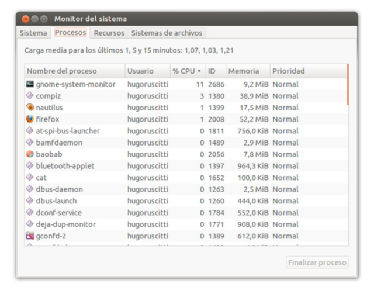

[`.org`](https://gitlab.com/osiux/osiux.gitlab.io/-/raw/master/procesos-linux.org) |
[`.md`](https://gitlab.com/osiux/osiux.gitlab.io/-/raw/master/procesos-linux.md) |
[`.gmi`](gemini://gmi.osiux.com/procesos-linux.gmi) |
[`.html`](https://osiux.gitlab.io/procesos-linux.html)

## ¿Qué es proceso?

-   Un proceso es la instancia de un programa en ejecución.
-   También se lo conoce como tarea.

## ¿Por qué?

-   GNU/Linux es un sistema multitarea, permite la ejecución de
múltiples procesos al mismo tiempo.

-   Comprender el concepto de procesos nos permite administrar el
rendimiento de nuestro equipo.

## Lo que el usuario ve:


## Lo que el sistema ve:




## `PID`

-   Todo proceso que se inicia tiene un número asignado llamado **PID**.

-   Este **PID** permite identificar el proceso y administrarlo
(detenerlo, reanudarlo etc...)

-   Ejemplo: Para obtener el **PID** de un proceso podemos usar el
comando `pidof`:

``` {.bash org-language="sh" exports="both" results="output"}
pidof init emacs
```

``` {.example}
1 15787
```

## Listar procesos

El comando `ps` puede listar el estado de los procesos:


## Operaciones

Los procesos se pueden controlar de manera externa.

El comando `kill`, `xkill` o `killall` permite enviarle señales a los
procesos. Por ejemplo la señal de terminación:


## Jerarquía

El comando pstree nos permite ver la organización de los procesos en
ejecución:

``` {.bash org-language="sh" exports="both" results="output"}
ps -fax | grep -A 10 bash | head
```

``` {.example}
2686 ?        S     50:52 /bin/bash /usr/share/siguibui/backend/shellserver.sh --daemon
21395 ?        S      0:00  \_ sleep 1
2691 ?        S      2:54 /usr/bin/python /usr/share/pywwetha/pywwetha.py --daemon
2692 ?        Ss     0:00 /usr/sbin/acpi_fakekeyd
2731 ?        Ss     0:28 /usr/sbin/acpid
2935 ?        Ss     0:30 /usr/sbin/apache2 -k start
3138 ?        S      0:00  \_ /usr/sbin/apache2 -k start
3139 ?        S      0:00  \_ /usr/sbin/apache2 -k start
3140 ?        S      0:00  \_ /usr/sbin/apache2 -k start
3141 ?        S      0:00  \_ /usr/sbin/apache2 -k start
```

``` {.bash org-language="sh" exports="both" results="output"}
pstree -p -U | head
```

``` {.example}
init(1)─┬─NetworkManager(3472)─┬─dhclient(3639)
│                      ├─{NetworkManager}(3518)
│                      └─{NetworkManager}(3662)
├─accounts-daemon(4022)───{accounts-daemon}(4024)
├─acpi_fakekeyd(2692)
├─acpid(2731)
├─apache2(2935)─┬─apache2(3138)
│               ├─apache2(3139)
│               ├─apache2(3140)
│               ├─apache2(3141)
```

## En tiempo real

Para visualizar los procesos en ejecución, también se puede usar `htop`
o `top`:

``` {.bash org-language="sh" exports="both" results="output"}
export TERM=linux
top -b -n1 | head -20
```

``` {.example}
top - 18:34:37 up 11 days,  1:02,  6 users,  load average: 0,76, 0,88, 0,86
Tasks: 180 total,   1 running, 179 sleeping,   0 stopped,   0 zombie
%Cpu(s): 13,9 us,  4,8 sy,  0,0 ni, 80,1 id,  0,6 wa,  0,5 hi,  0,2 si,  0,0 st
KiB Mem:   2044852 total,  1709304 used,   335548 free,    89148 buffers
KiB Swap:        0 total,        0 used,        0 free,   600420 cached

PID USER      PR  NI  VIRT  RES  SHR S  %CPU %MEM     TIME+ COMMAND
8203 root      20   0  121m  18m 6500 S   5,9  0,9   3:47.59 Xorg
26355 osiris    20   0 26096 1488 1080 R   5,9  0,1   0:00.02 top
1 root      20   0 10648  788  652 S   0,0  0,0   0:12.03 init
2 root      20   0     0    0    0 S   0,0  0,0   0:00.16 kthreadd
3 root      20   0     0    0    0 S   0,0  0,0  14:15.93 ksoftirqd/0
6 root      rt   0     0    0    0 S   0,0  0,0   0:00.00 migration/0
7 root      -2   0     0    0    0 S   0,0  0,0   3:50.22 rcuc/0
8 root      rt   0     0    0    0 S   0,0  0,0   0:00.00 rcun/0
9 root      -2   0     0    0    0 S   0,0  0,0   0:00.00 rcub/0
10 root      rt   0     0    0    0 S   0,0  0,0   0:00.00 rcun/1
11 root      -2   0     0    0    0 S   0,0  0,0   0:00.00 rcub/1
12 root      rt   0     0    0    0 S   0,0  0,0   0:00.00 migration/1
14 root      -2   0     0    0    0 S   0,0  0,0   5:24.04 rcuc/1
```


## Resumen

-   Los procesos son instancias de programas en funcionamiento.
-   Los recursos del sistema son limitados, el sistema administra y hace
posible compartir recursos.
-   Cada proceso tiene un identificador (`PID`), que nos sirve para
enviar señales.

## Changelog

\[2013-03-18 lun\] migro [slides
pdf](http://wiki.gcoop.coop/_media/apuntes:procesos.pdf) de Hugo
Ruscitti a `.org`
