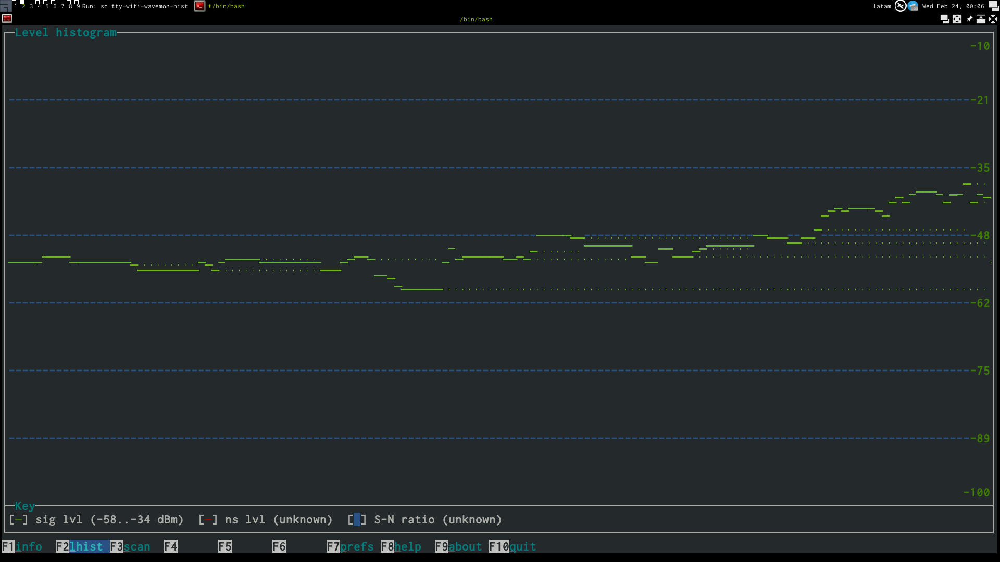

[`.org`](https://gitlab.com/osiux/osiux.gitlab.io/-/raw/master/tty.org) |
[`.md`](https://gitlab.com/osiux/osiux.gitlab.io/-/raw/master/tty.md) |
[`.gmi`](gemini://gmi.osiux.com/tty.gmi) |
[`.html`](https://osiux.gitlab.io/tty.html)

## *`dame una consola`* [^1] `<3`

Amo la `tty`, *terminal*, *consola*, `shell`, *línea de comandos*,
*emulador de terminal* y cualquier programa que use `ncurses` o
`ascii-art`.

El *`texto es el lenguaje universal`* y cada comando puede procesarlo y
su salida puede ser el ingreso de otro comando, es simple, rápido,
eficiente, consume poco espacio, poco ancho de banda y poca batería, es
altamente comprimible, es esencial, vital, puro, elegante y creativo.

No necesito nada más, en serio, puedo vivir en una `tty`, lo demostré en
mi *`semana negra`* [^2], la única aplicación que necesito usar a diario
es `firefox` y por ello utilizo *X* y obviamente aprovecho el arcoiris
de colores y soporte de mejoras visuales que me brinda `terminator`, mi
*emulador de terminal* preferido.

Prácticamente todos los comandos que uso están en `deb.sh` [^3] o en
`pip.sh` [^4] en el repositorio *`DiRePlOs`* [^5], pero siempre tuve
ganas de armar un listado con capturas de pantalla y una pequeña
*review*, y tal vez hasta alguna configuración extra que a continuación
iré detallando...

## shell

### `lsd`

Un reemplazo de `ls`, además de colores, agrega iconos *UTF-8* a cada
tipo de archivo y facilita la navegación de directorios.

### `bat`

Un multicolor sustituto de `cat`, con resaltado de sintaxis de varios
lenguajes, entona muy bien con `lsd`.

## music

### `mocp`

Mi reproductor favorito de *`Music On Console`* [^6], dentro de un
`tmux` combina muy bien con `pulsemixer` y `cava`.

## wifi

### `wicd-curses`

Detesto el `network-manager` porque decide por mi, por eso siempre uso
`wicd-ncurses`, simple y efectivo, suelo dejar que se ocupe de la *WiFi*
y que no me toque la `eth0`, de esa me ocupo yo!

### `wavemon`

Si querés mejorar la señal de tu conexión *WiFi* es ideal utilizar
`wavemon` que te brinda datos precisos, un histograma de la señal para
que puedas buscar la mejor ubicación fácilmente, además permite
*scannear* redes.

... continuará ...

[^1]: <https://osiux.com/dame-una-consola.html>

[^2]: <https://osiux.com/2014-04-28-semana-negra.html>

[^3]: <https://gitlab.com/osiux/direplos/-/raw/master/deb.sh>

[^4]: <https://gitlab.com/osiux/direplos/-/raw/master/pip.sh>

[^5]: <https://gitlab.com/osiux/direplos>

[^6]: <https://osiux.com/2021-02-14-tty-music-on-console.html>
