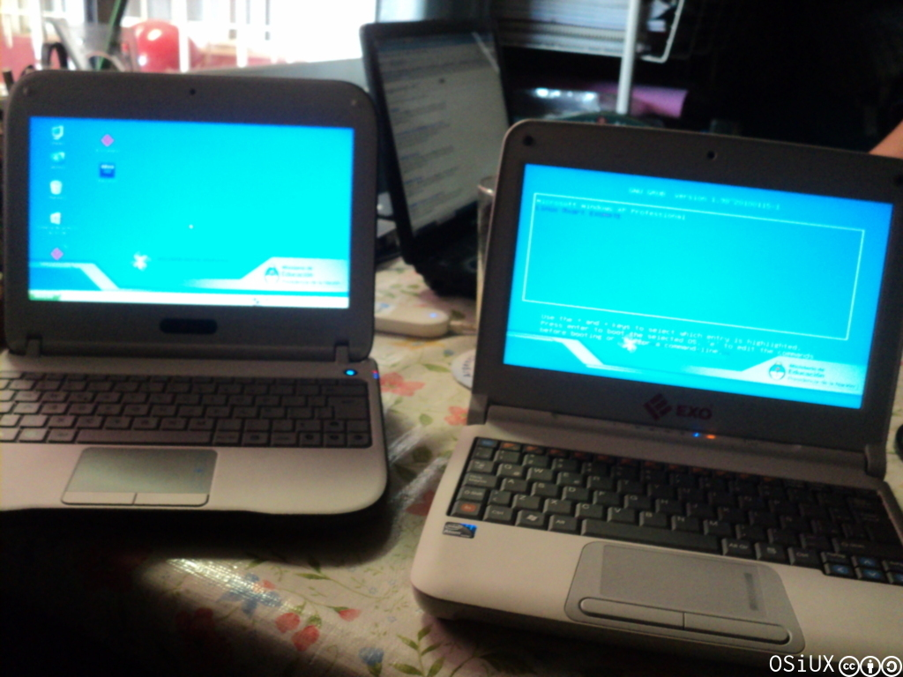
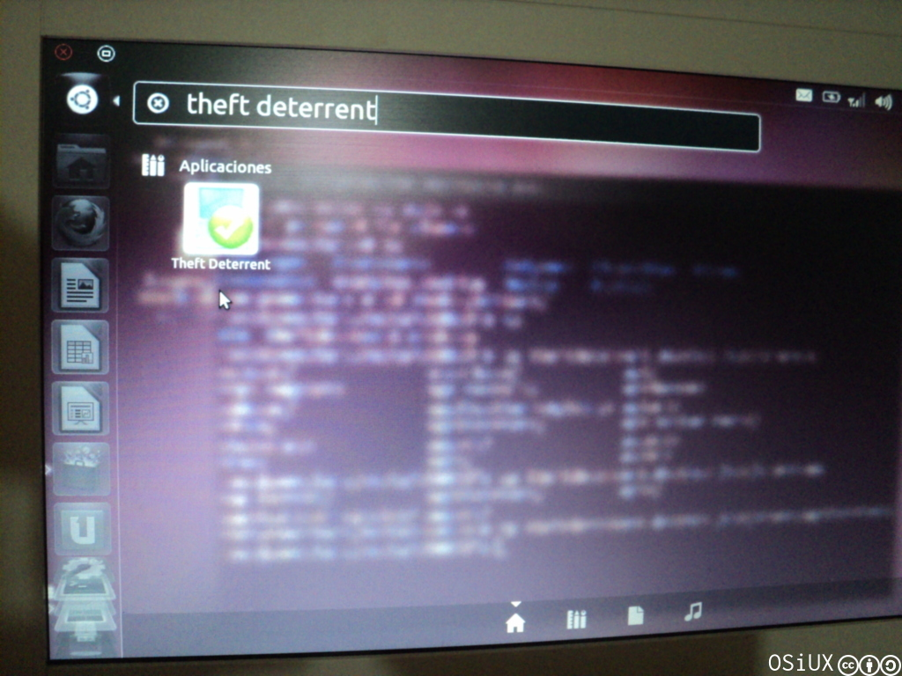
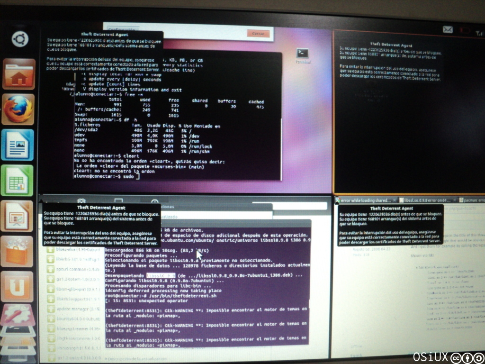

[`.org`](https://gitlab.com/osiux/osiux.gitlab.io/-/raw/master/ubuntu-11.10-en-exomate-de-conectar-igualdad.org) |
[`.md`](https://gitlab.com/osiux/osiux.gitlab.io/-/raw/master/ubuntu-11.10-en-exomate-de-conectar-igualdad.md) |
[`.gmi`](gemini://gmi.osiux.com/ubuntu-11.10-en-exomate-de-conectar-igualdad.gmi) |
[`.html`](https://osiux.gitlab.io/ubuntu-11.10-en-exomate-de-conectar-igualdad.html)

El sábado 22 en la Ciudad de Curuzú Cuatiá gracias a Liliana Arbelo,
tuve la oportunidad de jugar un poco con varias notebooks del **Programa
Conectar Igualdad** [^1]

Un día antes, estuvimos en la Ciudad de Monte Caseros, dando charlas
sobre Software Libre en el cierre de la **Primera Olimpíada Interescolar
Informática de Nivel Secundario** y la **Primera Olimpíada de
Informática Escolar en el Nivel Programación** en la Escuela Técnica
**Pedro Ferré**, y a los asistentes les gustó mucho la última versión de
Ubuntu [^2] la cual grabamos en muchos pendrives.

Hay una nota sobre el evento en:

-   [file:olimpiadas-informaticas-en-monte-caseros.org](olimpiadas-informaticas-en-monte-caseros)

Por esto decidimos probar de instalarla en las notebooks, los modelos
usados tenían **rxart**, y la idea era usar otra distro, el desafío era
que funcione con el agente que valida las claves de bloqueo contra el
servidor de la escuela.



## Empaquetando Theft Deterrent Agent

El primer paso fue seguir el tutorial de Nico Echaniz sobre cómo
empaquetar el **Theft Deterrent Agent** [^3]. Básicamente hay que
instalar el paquete `dpkg-repack`, empaquetar `tdagent` y `libtdagent`,
con esto obtenemos 2 paquetes `.deb` listos para instalar en cualquier
distribución basada en **debian** [^4].

## Instalando Ubuntu 11.10


Arrancamos desde un pendrive y especificamos manualmente las
particiones, de esa manera elegimos la partición `/dev/sdb2` como raíz
`/` del sistema y mantuvimos `/dev/sdb4/` como `swap`. Una vez
finalizada la instalación nos quedó un nuevo `GRUB` invocando por
defecto a `Ubuntu 11.10` y el resto lo mantuvo igual.

## Instalando Theft Deterrent Agent



En teoría bastaba con copiar los 2 paquetes `.deb` y hacer:

``` {.example}
dpkg -i libtdagent_1.0netbook0natick3_i386
dpkg -i tdagent_2.0.0.100netbook0natick7_i386
```

Sin embargo al querer iniciar `/usr/bin/theftdeterrent.sh` tiraba un
error, faltaba una librería de SSL, asi que la descargué en otra compu y
copié con un pendrive para finalmente instalarla:

``` {.example}
dpkg -o libssl0.9.8
```

Luego corrí el agente y salió andando, al menos mostraba un mensaje de
que era necesario conectarse al servidor de la escuela para que no se
bloquee la compu, lamentablemente no teníamos a mano el servidor de la
escuela, pero en principio parece funcionar bien.



Entusiasmados decidimos actualizar ubuntu, para esto usamos un modem
huawei de claro para conectarnos, ubuntu lo detectó de una sola vez y
salió andando, instalamos varias aplicaciones y luego del reboot
sorpresivamente dejó de reconocer el **modém huawei**, por suerte
contaba con un tutorial sobre cómo hacer funcionar un **modem3g de
Claro** en Debian, el cual permitió conectarnos nuevamente a internet y
terminar la actualización del sistema:

-   [file:modem-3g-claro.org](modem-3g-claro)


[^1]: <http://www.conectarigualdad.gob.ar/>

[^2]: <http://ubuntu.com>

[^3]: [file:conectar-igualdad-empaquetando-intel-theft-deterrent-agent.org](conectar-igualdad-empaquetando-intel-theft-deterrent-agent)

[^4]: <http://debian.org>
