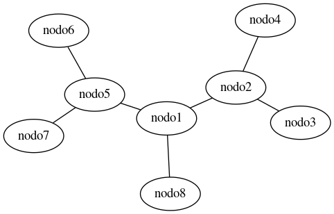
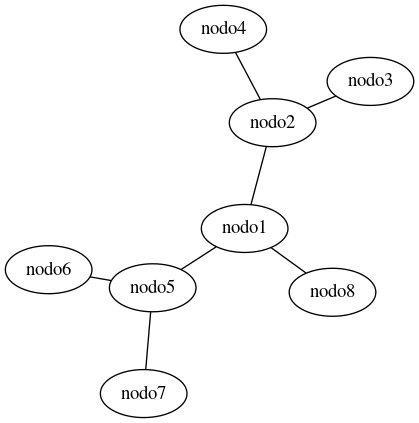
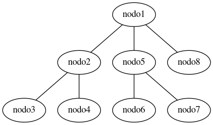
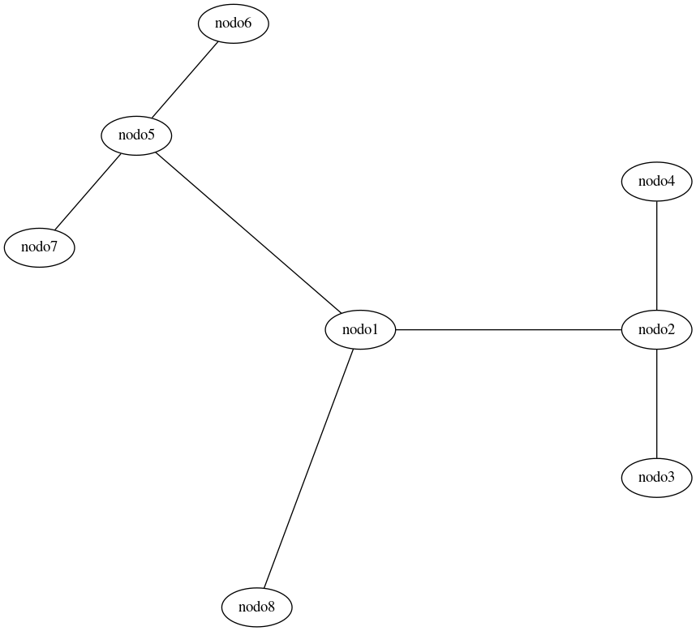

[`.org`](https://gitlab.com/osiux/osiux.gitlab.io/-/raw/master/visualizando-grafos-graphviz.org) |
[`.md`](https://gitlab.com/osiux/osiux.gitlab.io/-/raw/master/visualizando-grafos-graphviz.md) |
[`.gmi`](gemini://gmi.osiux.com/visualizando-grafos-graphviz.gmi) |
[`.html`](https://osiux.gitlab.io/visualizando-grafos-graphviz.html)

## Introducción

Generación de distintos grafos como estructuras de datos, estructuras de
árbol, diagramas entidad-relación, de redes, de flujo, etc, utilizando
el conjunto de herramientas Graphviz y su integración con otras
aplicaciones. Desarrollo de scripts para la generación automática de
grafos directamente desde una consola.

## Qué es Graphviz?

Es un conjunto de herramientas open-source realizado inicialmente en los
laboratorios de investigación de AT&T para el dibujo de gráficos
especificados en lenguaje de scripts DOT. Provee librerías para ser
usadas por otras aplicaciones. Graphviz es software libre licenciado
bajo CPL (Common Public License).

## Aplicaciones

-   Estructuras de datos.
-   Estructuras de árbol.
-   Representación de análisis social de redes.
-   Diagramas entidad relación.
-   Diagramas de redes.
-   Diagramas de flujo.
-   Diagramas de procesos.

## Grafos

Un grafo es un conjunto de objetos llamados vértices (o nodos) y una
selección de pares de vértices, llamados aristas (arcs en inglés) que
pueden ser orientados o no. Típicamente, un grafo se representa mediante
una serie de puntos (los vértices) conectados por líneas (las aristas).

## Generadores de gráficos

### `dot` Gráficos direccionales

``` {.dot exports="code"}
digraph dot
{
nodo1 -> nodo2;
nodo2 -> nodo3;
nodo2 -> nodo4;
nodo1 -> nodo5;
nodo5 -> nodo6;
nodo5 -> nodo7;
nodo1 -> nodo8;
}
```

{width="429" height="251"
title="gráficos direccionales"}

### `neato` Gráficos no-direccionales

``` {.dot exports="code"}
graph neato
{
nodo1 -- nodo2;
nodo2 -- nodo3;
nodo2 -- nodo4;
nodo1 -- nodo5;
nodo5 -- nodo6;
nodo5 -- nodo7;
nodo1 -- nodo8;
}
```

{width="482" height="308"
title="gráficos no direccionales"}

### `twopi` Gráficos radiales

``` {.dot exports="code"}
graph twopi
{
nodo1 -- nodo2;
nodo2 -- nodo3;
nodo2 -- nodo4;
nodo1 -- nodo5;
nodo5 -- nodo6;
nodo5 -- nodo7;
nodo1 -- nodo8;
}
```

{width="419" height="423"
title="gráficos radiales"}

### `fdp` Gráficos no-direccionales

``` {.dot exports="code"}
graph fdp
{
nodo1 -- nodo2;
nodo2 -- nodo3;
nodo2 -- nodo4;
nodo1 -- nodo5;
nodo5 -- nodo6;
nodo5 -- nodo7;
nodo1 -- nodo8;
}
```

{width="429" height="251"
title="gráficos no direccionales"}

### `circo` Gráficos circulares

``` {.dot exports="code"}
graph circo
{
nodo1 -- nodo2;
nodo2 -- nodo3;
nodo2 -- nodo4;
nodo1 -- nodo5;
nodo5 -- nodo6;
nodo5 -- nodo7;
nodo1 -- nodo8;
}
```

{width="858" height="778"
title="gráficos circulares"}
